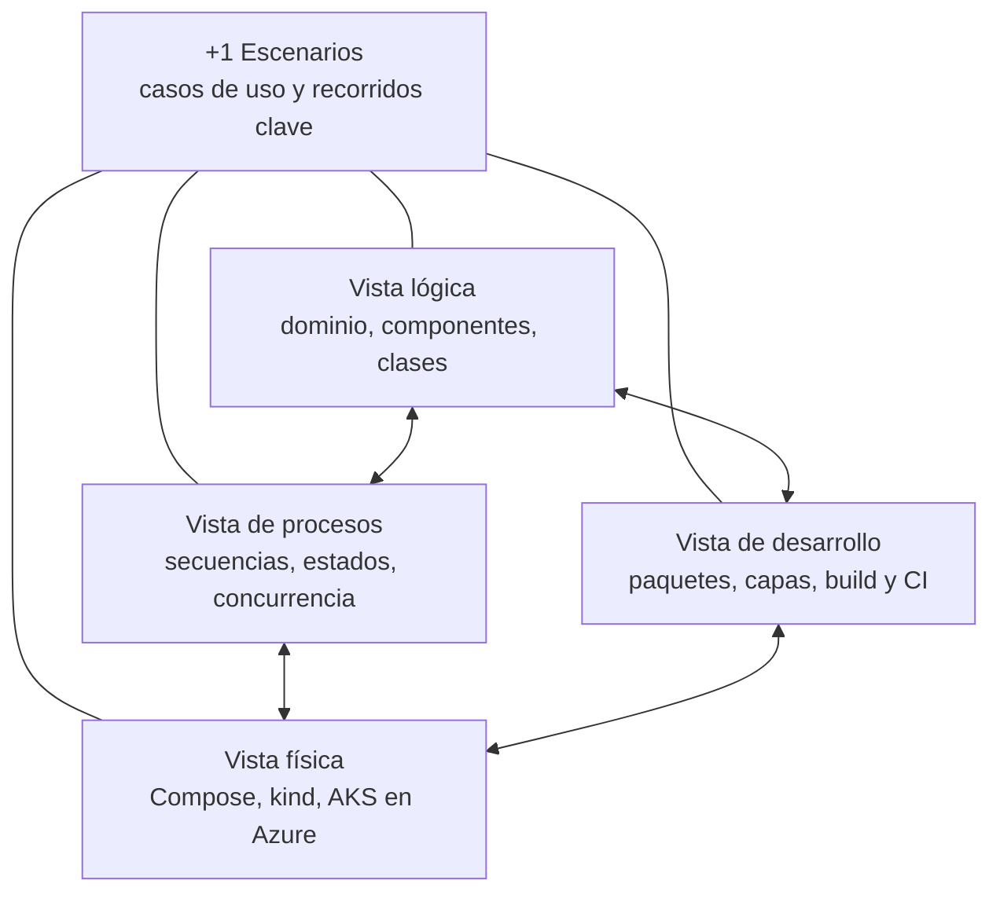
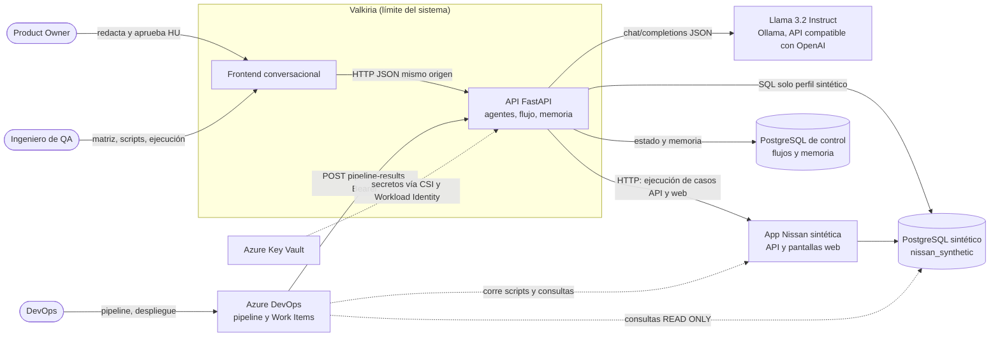
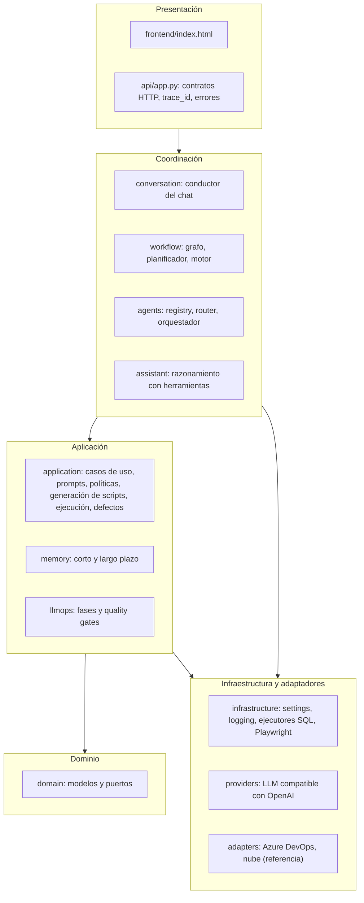

# Arquitectura de Valkiria (modelo 4+1)

Esta es la documentación de arquitectura de Valkiria v0.5.0 según el modelo de vistas **4+1** de Philippe Kruchten. Describe el sistema **tal como está implementado** en `src/valkiria/`, no un diseño ideal. Donde el código se aparta de los principios declarados, se indica de forma explícita. Todos los diagramas usan Mermaid y se ven directamente en GitHub y en Azure DevOps.

## Cómo leer esta documentación

| Vista | Pregunta que responde | Audiencia principal | Documento |
|---|---|---|---|
| **+1 Escenarios** | ¿Qué hace el sistema y para quién? ¿Qué casos de uso validan la arquitectura? | Todos | [01 · Escenarios](arquitectura/01-escenarios.md) |
| **Lógica** | ¿Qué abstracciones, responsabilidades y relaciones existen? | Desarrollo, arquitectura | [02 · Vista lógica](arquitectura/02-vista-logica.md) |
| **Procesos** | ¿Cómo colaboran los componentes en tiempo de ejecución? ¿Cómo se manejan concurrencia, fallos y estados? | Desarrollo, operación | [03 · Vista de procesos](arquitectura/03-vista-procesos.md) |
| **Desarrollo** | ¿Cómo se organiza el código, se construye, se prueba y se integra? | Desarrollo, DevOps | [04 · Vista de desarrollo](arquitectura/04-vista-desarrollo.md) |
| **Física** | ¿Dónde se ejecuta cada pieza, cómo se comunica y cómo se protege? | DevOps, seguridad, operación | [05 · Vista física](arquitectura/05-vista-fisica.md) |
| Transversal | ¿Qué decisiones se tomaron y por qué? ¿Qué atributos de calidad se cumplen y qué riesgos quedan? | Arquitectura, liderazgo técnico | [06 · Decisiones, calidad y riesgos](arquitectura/06-decisiones-calidad-riesgos.md) |

Los escenarios de la vista +1 son el hilo conductor: cada vista se valida contra ellos. El escenario principal es el **flujo completo de una historia en el chat**: HU → INVEST → aprobación → matriz → scripts y consultas → ejecución → revisión de fallos → pipeline.

## Qué es Valkiria

Valkiria es una plataforma multiagente de QA para Nissan. Convierte un requerimiento en lenguaje natural en artefactos de QA verificables y trazables:
- historia de usuario versionada;
- evaluación INVEST;
- matriz de pruebas;
- análisis de riesgo;
- scripts de automatización;
- consultas de validación de datos;
- ejecución con evidencia;
- borradores de defecto;
- pipeline de Azure DevOps;
- diseño de performance;
- Work Item.

Todo opera sobre **datos sintéticos**. Una persona aprueba cada entregable sobre su versión exacta. El modelo de lenguaje (**Llama 3.2 Instruct 3B**, autoalojado con Ollama) redacta contenido, pero **no decide el flujo**: la planificación es determinista y auditable.

## Contexto del sistema

Fuera del límite de Valkiria quedan los sistemas productivos de Nissan: **ninguno está conectado**. La publicación real en Azure Boards (HU-006, HU-004B) y Azure Load Testing (HU-008B) existe solo como vista previa o adaptador de referencia.

## Impulsores arquitectónicos

| Id | Impulsor | Origen | Consecuencia en la arquitectura |
|---|---|---|---|
| AD-1 | Control humano sobre todo entregable (RT-02) | Épica v3.0 | Aprobaciones sobre versión y hash exactos; "siguiente" nunca aprueba |
| AD-2 | Un LLM pequeño (3B) no es confiable para planificar | Pruebas con Llama 3.2 | Planificador determinista sobre un grafo; el LLM solo redacta |
| AD-3 | Cero datos y sistemas productivos | Seguridad y cumplimiento | Perfil `synthetic`, producción bloqueada al arrancar, DSN nunca en requests |
| AD-4 | Trazabilidad extremo a extremo | Auditoría QA | `trace_id` en HTTP, agentes, flujo, evidencia y logs |
| AD-5 | No romper la conversación (RT-04) | Experiencia de usuario | Errores del modelo se convierten en una respuesta reintentable; el flujo se conserva |
| AD-6 | Azure como única plataforma | Decisión organizacional | AKS, ACR, Key Vault, PostgreSQL Flexible Server, Azure DevOps |
| AD-7 | Evidencia honesta | Calidad del proceso | Preview, simulación y ejecución real con estados distintos; nada se simula |
| AD-8 | Latencia aceptable en CPU | Costo | Matriz por criterio en paralelo, presupuesto de tokens por tarea |

## Vista general en capas

La [vista de desarrollo](arquitectura/04-vista-desarrollo.md#dependencias-reales-entre-paquetes) muestra el grafo de dependencias real, incluidas las dos desviaciones conocidas respecto de la arquitectura hexagonal.

## Principios

1. **Hexagonal (puertos y adaptadores):** el dominio no hace I/O y depende de protocolos (`LLMPort`, `DatabaseExecutor`, `WorkflowStore`, `LongTermStore`…).
2. **Determinismo donde importa:** el enrutamiento, la planificación, las políticas, la clasificación de fallos y la validación son código; el LLM redacta.
3. **Fail closed:** ambigüedad, política fallida, versión superada o falta de aprobación detienen el paso.
4. **Defensa en profundidad:** validación Pydantic, políticas en código, análisis estático de SQL, aprobación humana, PR obligatorio y release en preview.
5. **Trazabilidad:** `trace_id`, `based_on`, `memory_used`, `model` y `prompt_version` en cada artefacto.
6. **Evidencia honesta:** las plantillas, las correcciones y los resultados no ejecutados se declaran en `warnings`.

## Documentos relacionados

- Detalle funcional: [Conductor de la conversación](conversacion.md), [Flujo por historia](flujo-historias.md), [Orquestación multiagente](multiagente-orquestacion.md), [Asistente](asistente.md) y [Memoria](memoria.md).
- Operación: [Despliegue](despliegue.md), [Seguridad](security.md), [Observabilidad](observabilidad-y-errores.md) y [LLMOps](llmops-lifecycle.md).
- Requisitos: [Épica e historias INVEST](epica-historias-invest.md) y [HU-010 y HU-011](hu010-hu011.md).
