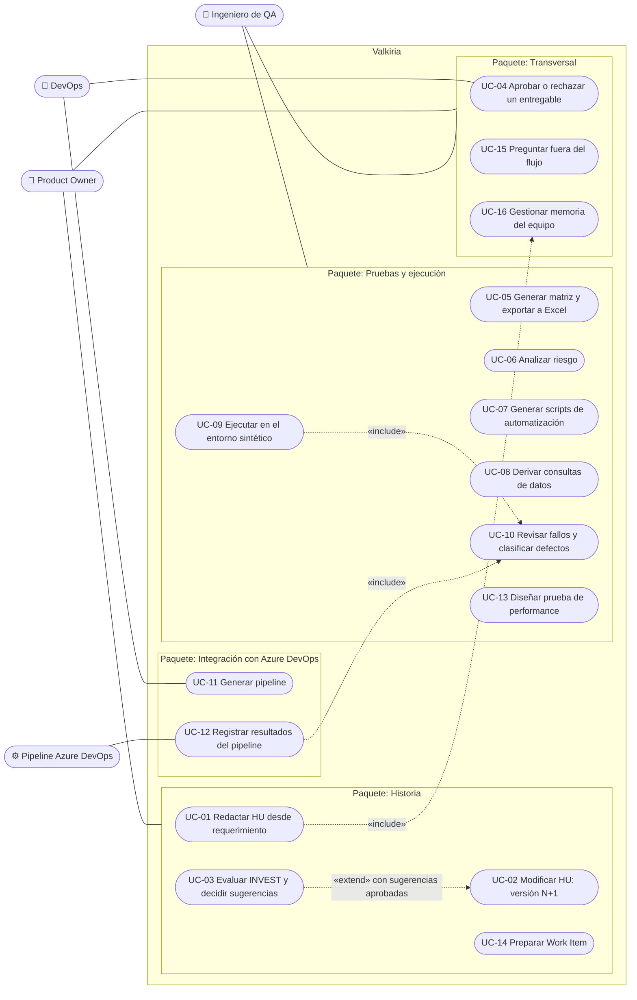
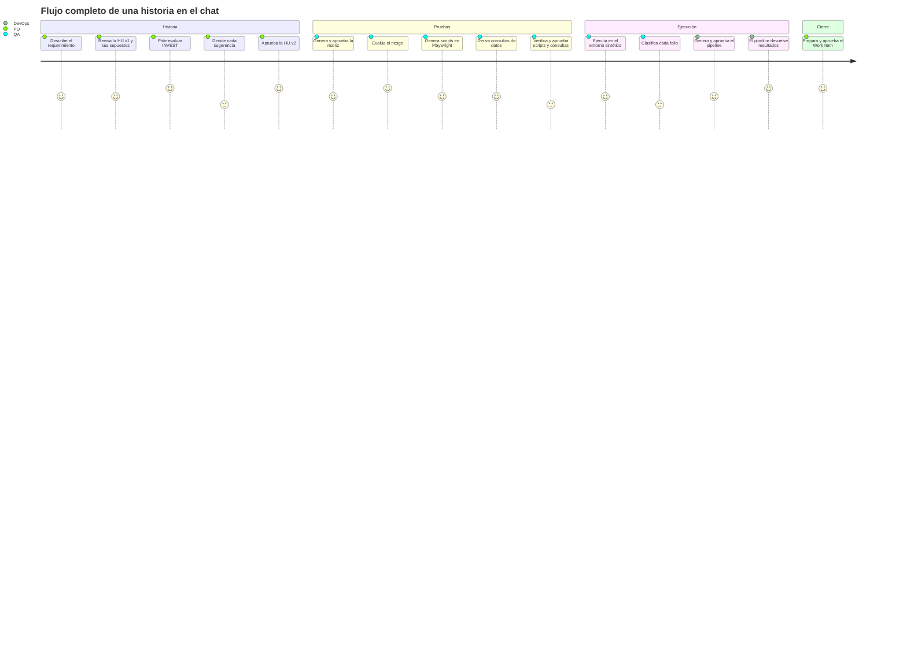
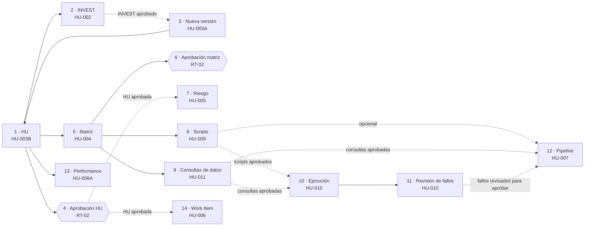

# +1 · Vista de escenarios

[← Índice de arquitectura](../arquitectura.md)

La vista de escenarios une a las otras cuatro. Describe quién usa Valkiria, qué casos de uso ofrece y qué recorridos validan la arquitectura. Cada escenario clave se detalla como secuencia en la [vista de procesos](03-vista-procesos.md).

## Actores

| Actor | Tipo | Interés |
|---|---|---|
| Product Owner (PO) | Humano, principal | Redactar, ajustar y aprobar historias; decidir sugerencias INVEST; publicar el Work Item |
| Ingeniero de QA | Humano, principal | Matriz, riesgo, scripts, consultas de datos, ejecución y revisión de fallos |
| DevOps | Humano, principal | Pipeline de Azure DevOps, despliegue y operación en Azure |
| Pipeline de Azure DevOps | Sistema, principal | Ejecuta los scripts y consultas aprobados y devuelve los resultados JUnit |
| Llama 3.2 Instruct | Sistema, secundario | Redacta HU, INVEST, matriz, riesgo, consultas y respuestas |
| App Nissan sintética | Sistema, secundario | Expone la API y las pantallas web contra las que se ejecutan los casos |
| PostgreSQL sintético | Sistema, secundario | Datos ficticios de Nissan para HU-011 |

## Diagrama de casos de uso

Mermaid no tiene un diagrama de casos de uso nativo. Se representa con la notación UML equivalente: actores fuera del límite y casos de uso como óvalos dentro, agrupados en paquetes. Una línea de un actor a un paquete indica que participa en todos sus casos de uso.

## Catálogo de casos de uso

| UC | Caso de uso | HU | Entrada | Precondición | Postcondición | Punto de entrada |
|---|---|---|---|---|---|---|
| UC-01 | Redactar HU | HU-003B | Requerimiento | — | HU v1 en borrador, con supuestos | `POST /v1/chat`, `POST /v1/workflows` |
| UC-02 | Modificar HU | HU-003A | Instrucción o edición | HU existente | HU vN+1; dependientes desactualizados | `POST /v1/chat`, `PUT /v1/workflows/{id}/artifacts/story` |
| UC-03 | Evaluar INVEST | HU-002 | — | HU (borrador) | 6 criterios con justificación y sugerencias | `POST /v1/chat` (acción `run`) |
| UC-04 | Aprobar o rechazar | RT-02 | Versión, hash, decisión | Artefacto aprobable | Aprobación ligada a versión y hash | `POST /v1/workflows/{id}/approvals`, acción `approve` |
| UC-05 | Matriz | HU-004 | — | HU (borrador) | Positivo, negativo y borde por criterio (máx. 30) | Acción `run` + `export_matrix` |
| UC-06 | Riesgo | HU-005 | — | HU **aprobada** | Nivel bajo, medio o alto con puntajes 1–5 | Acción `run` |
| UC-07 | Scripts | HU-009 | Stack y repositorio | Matriz | Lotes ≤ 15 casos, lint y escaneo de secretos | Acción `run` / `input` |
| UC-08 | Consultas de datos | HU-011 | — | Matriz | Consultas `SELECT` probadas en la base sintética | Acción `run` |
| UC-09 | Ejecutar | HU-010 | — | Scripts o consultas **aprobados** | Resultados por caso y evidencia PDF | Acción `run` (goal `execution`) |
| UC-10 | Revisar fallos | HU-010 | Decisión por fallo | Ejecución con fallos | Borradores de defecto clasificados | Acción `review_defects` |
| UC-11 | Pipeline | HU-007 | — | — (usa scripts y consultas si existen) | YAML + `validate_data.py` + `report_results.py` | Acción `run` |
| UC-12 | Resultados del pipeline | HU-010 | JUnit | Token de callback | Nueva versión de la ejecución y su revisión | `POST /v1/workflows/{id}/pipeline-results` |
| UC-13 | Performance | HU-008A | Usuarios, duración, SLA | HU | Escenario JMeter o Locust (sin ejecutar) | Acción `run` / `input` |
| UC-14 | Work Item | HU-006 | Proyecto | HU **aprobada** | Vista previa aprobable con idempotencia | Acción `run` / `input` |
| UC-15 | Pregunta fuera del flujo | — | Pregunta | — | Respuesta con herramientas o límite honesto | `POST /v1/assistant/ask`, `/v1/chat` |
| UC-16 | Memoria | — | Hecho, búsqueda u olvido | — | Recuerdo redactado, deduplicado y aislado | `/v1/memory/...` |

Casos de uso secundarios, expuestos como API REST sin flujo: historias, INVEST, matriz y riesgo aislados (`/v1/stories/...`); lotes de automatización (`/v1/automation/...`); SQL seguro (`/v1/database/...`); y orquestación multiagente de una petición (`/v1/agent/execute`).

## Recorrido del usuario en el flujo principal

## Mapa del flujo de 14 pasos

Este es el panel lateral de la interfaz (`conversation/flow.py: STEPS`). Las flechas sólidas son dependencias de datos; las punteadas, dependencias de aprobación humana.

## Escenarios clave

Cada escenario ejercita una parte crítica de la arquitectura. La columna "Validado por" indica la prueba automatizada que lo cubre.

| Id | Escenario | Qué valida de la arquitectura | Secuencia | Validado por |
|---|---|---|---|---|
| E1 | Del requerimiento a la HU aprobada: redactar, evaluar INVEST, decidir sugerencias, nueva versión y aprobar con supuestos | Conductor, motor de flujo, versionado, aprobaciones, memoria de largo plazo | [P-2](03-vista-procesos.md#p-2-mensaje-en-el-chat-hasta-un-paso-del-flujo) | `tests/test_conversation.py` |
| E2 | Pregunta a mitad del flujo ("¿qué concesionarios están inactivos?") | Enrutamiento determinista, asistente con herramientas, recordatorio del paso en curso | [P-4](03-vista-procesos.md#p-4-asistente-de-razonamiento-con-herramientas) | `tests/test_assistant.py` |
| E3 | Modificar la HU aprobada: se crea vN+1 y la matriz queda desactualizada | `based_on`, planificador (`rerun`), hash de aprobación | [P-3](03-vista-procesos.md#p-3-motor-de-flujo-planificar-ejecutar-y-guardar) | `tests/test_workflow.py` |
| E4 | Aprobar una versión superada | Control optimista y validación de versión y hash → `409` | [P-6](03-vista-procesos.md#p-6-aprobación-humana-rt-02) | `tests/test_workflow_api.py` |
| E5 | El modelo no responde a tiempo | Reintentos con espera exponencial, falla aislada, respuesta reintentable (RT-04) | [P-8](03-vista-procesos.md#p-8-manejo-de-errores-y-reintentos) | `tests/test_workflow.py`, `tests/test_conversation.py` |
| E6 | Ejecutar scripts y consultas aprobados, y revisar fallos | Ejecución unificada HU-010, ejecutor SQL seguro, runner Chromium, triage determinista | [P-5](03-vista-procesos.md#p-5-ejecución-unificada-hu-010-y-revisión-de-fallos) | `tests/test_hu010_hu011.py`, `tests/e2e/` |
| E7 | El pipeline de Azure DevOps devuelve sus JUnit | Token Bearer, mapeo a casos de la matriz, nueva versión de la ejecución | [P-7](03-vista-procesos.md#p-7-ida-y-vuelta-con-el-pipeline-de-azure-devops) | `tests/test_defects_and_pipeline.py` |
| E8 | `DROP TABLE` o `UPDATE` sin `WHERE` | Análisis estático, fail closed antes de conectar | [P-9](03-vista-procesos.md#p-9-ejecución-segura-de-sql-hu-011) | `tests/test_synthetic_database.py`, `tests/test_sql_dialect.py`, `tests/e2e/test_postgres_mutations.py` |
| E9 | "Despliega en producción" o "haz commit directo a main" | Políticas en código sin pasar por el LLM | [P-4](03-vista-procesos.md#p-4-asistente-de-razonamiento-con-herramientas) | `tests/test_assistant.py` |
| E10 | Petición aislada por `/v1/agent/execute` | Registry, router, handoffs con `trace_id`, quality gates | [P-1](03-vista-procesos.md#p-1-orquestación-multiagente-de-una-petición) | `tests/test_multiagent_orchestration.py` |

## Trazabilidad de escenarios a vistas

| Escenario | Lógica | Procesos | Desarrollo | Física |
|---|---|---|---|---|
| E1 | `ConversationController`, `WorkflowEngine`, `ValkiriaService`, `MemoryService` | Secuencia del chat y bloqueo por flujo | `conversation/`, `workflow/`, `application/` | API ↔ Ollama, flujos en PostgreSQL |
| E2 | `ReasoningAssistant`, `ToolBox` | Ciclo decidir → ejecutar → observar | `assistant/` | API ↔ app sintética |
| E3 | `ArtifactRecord.based_on`, `plan()` | Máquina de estados del artefacto | `workflow/planner.py` | — |
| E4 | `Approval`, `WorkflowState.revision` | Control optimista | `workflow/state.py` | Réplicas de la API |
| E5 | `LLMProviderError`, `StepFailure` | Reintentos y aislamiento | `providers/`, `workflow/engine.py` | Timeout API ↔ Ollama |
| E6 | `run_execution`, `PlaywrightRunner`, `SyntheticPostgresExecutor` | Ejecución unificada | `application/`, `infrastructure/` | Imagen `-browser`, app sintética, PostgreSQL |
| E7 | `record_pipeline_results` | Ida y vuelta asíncrona | `application/pipeline_files.py` | Azure DevOps → Ingress → API, Key Vault |
| E8 | `static_analyse_database_script`, `sql_dialect` | Transacción y rollback | `application/`, `infrastructure/` | PostgreSQL sintético |
| E9 | `policy_block` | Corto circuito antes del LLM | `assistant/capabilities.py` | — |
| E10 | `AgentRegistry`, `AgentRouter`, `MultiAgentOrchestrator` | Plan secuencial con reintento | `agents/` | — |
