# Vista lógica

[← Índice de arquitectura](../arquitectura.md)

La vista lógica describe las abstracciones de Valkiria, sus responsabilidades y sus relaciones, sin entrar en hilos, procesos ni despliegue. Los nombres de clases y funciones coinciden con el código de `src/valkiria/`.

## 1. Componentes

Valkiria tiene cuatro **puntos de coordinación**, cada uno para un tipo de interacción, que comparten los mismos servicios de aplicación:

| Coordinador | Interacción | Estado | Decide con |
|---|---|---|---|
| `ConversationController` | Chat: mensaje o acción de la interfaz | Sesión (memoria corta) ligada a un flujo | Reglas sobre el mensaje y el estado del flujo |
| `WorkflowEngine` | Ciclo de vida de una historia (HU-002 a HU-011) | `WorkflowState` persistente y versionado | Planificador determinista sobre el grafo de capacidades |
| `MultiAgentOrchestrator` | Petición aislada (`/v1/agent/execute`) | `AgentContext` efímero | `AgentRouter` con `can_handle` de cada agente |
| `ReasoningAssistant` | Pregunta o petición fuera del flujo | Pasos del razonamiento | LLM dentro de un catálogo cerrado y verificaciones en código |

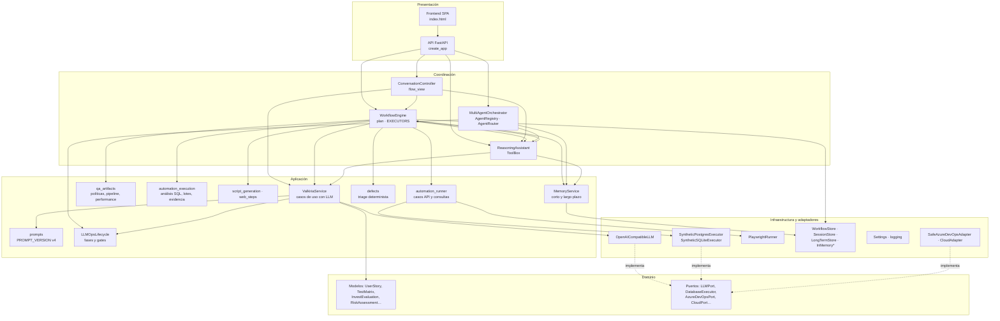

`create_app()` en `api/app.py` es la **raíz de composición**: construye `Settings`, los almacenes, el proveedor LLM, el ejecutor SQL, el runner opcional, `ValkiriaService`, `MemoryService`, `WorkflowEngine`, `ReasoningAssistant`, `ConversationController` y `MultiAgentOrchestrator`, e inyecta las dependencias por constructor. No hay contenedor de inyección ni estado global.

## 2. Modelo de dominio

Entidades y objetos de valor de `domain/`. No dependen de ningún otro paquete de Valkiria.

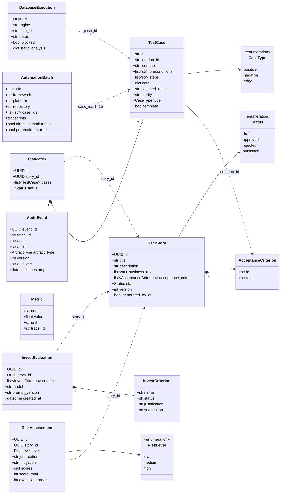

Reglas de negocio que el modelo impone por validación Pydantic:
- una HU tiene entre 1 y 30 criterios;
- INVEST tiene exactamente 6 criterios;
- una matriz tiene como máximo 30 casos;
- un lote de automatización tiene entre 1 y 15 casos;
- `UserStory` prohíbe campos extra.

El nivel de riesgo se deriva de la suma de complejidad, dependencias y criticidad, cada una de 1 a 5: 3–6 es bajo, 7–11 medio y 12–15 alto.

## 3. Modelo del flujo por historia

El flujo por historia (`workflow/`) es el núcleo de Valkiria. `WorkflowState` es el agregado: todo cambio entra por `WorkflowEngine` y se guarda completo, con control optimista por `revision`.

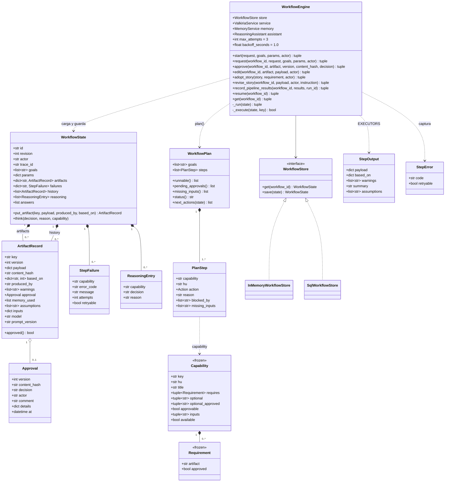

Conceptos clave:
- **`based_on`**: versiones de las dependencias con que se generó el artefacto. Si una dependencia declarada cambia de versión, el planificador marca el artefacto como `rerun`.
- **`approved`**: es una propiedad calculada, no un campo. Una aprobación solo vale si su `version` y su `content_hash` coinciden con los vigentes. Editar el artefacto invalida la aprobación sin tener que borrarla.
- **`inputs`**: datos del usuario con los que se generó (stack, repositorio, parámetros de performance). Si cambian en `params`, el artefacto se regenera.
- **`history`**: versiones anteriores de cualquier artefacto (auditoría y panel de versiones).

### Grafo de capacidades

`workflow/graph.py: CAPABILITIES` declara 14 capacidades. Se valida al importar el módulo: no puede haber ciclos ni dependencias desconocidas, y el orden topológico queda en `TOPOLOGICAL_ORDER`.

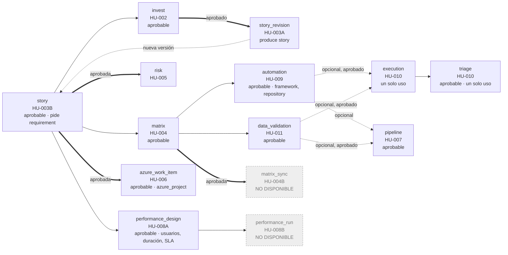

Leyenda: `-->` requiere el artefacto (basta el borrador); `==>` requiere el artefacto **aprobado** por una persona; `-.->` dependencia opcional: se usa si existe y, cuando cambia, obliga a regenerar.

### Acciones del planificador

`workflow/planner.py: plan()` clasifica cada capacidad alcanzable desde los objetivos en una de ocho acciones:

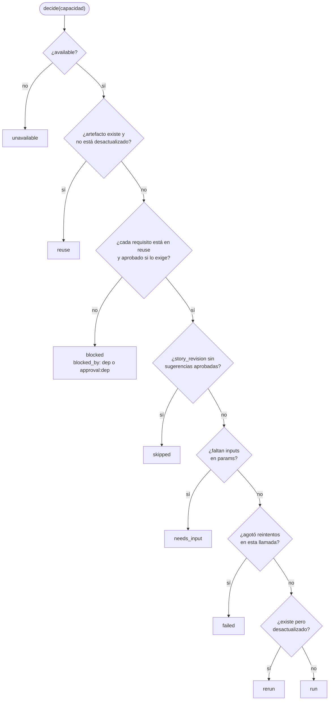

El estado global del plan se deriva de las acciones con esta precedencia: `running` > `waiting_approval` > `needs_input` > `failed` > `partially_completed` > `completed`.

## 4. Agentes y orquestación multiagente

`agents/` implementa la orquestación de una petición aislada. Cada agente cumple el protocolo `SpecializedAgent` y hereda de `BaseAgent` los constructores de resultado (`success`, `pending`, `blocked`, `failure`).

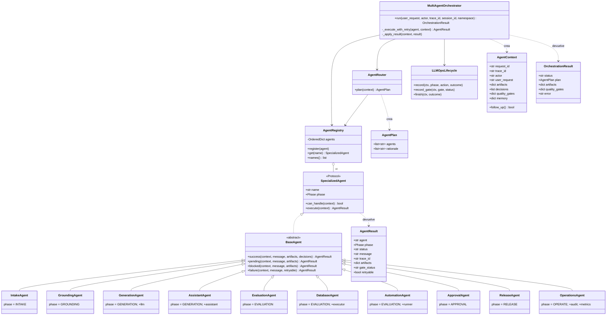

| Agente | Fase (gate) | `can_handle` | Resultado típico |
|---|---|---|---|
| `intake` | INTAKE (G0) | Siempre | Intenciones por palabras clave; hereda la de la sesión en un seguimiento |
| `grounding` | GROUNDING (G1) | Siempre | Políticas y fuentes; `blocked` si la petición es ambigua |
| `generation` | GENERATION (G2) | `route_message == "story"` | Artefacto JSON del LLM o borrador determinista sin LLM |
| `assistant` | GENERATION (G2) | `route_message == "assistant"` | Respuesta con herramientas |
| `evaluation` | EVALUATION (G3) | `route_message == "story"` | INVEST pendiente de revisión, cobertura y riesgo |
| `database` | EVALUATION (G3) | SQL, base de datos, inventario, vehículos | Consulta de referencia en la base sintética |
| `automation` | EVALUATION (G3) | Playwright, Selenium, E2E | Preview o ejecución si hay runner |
| `approval` | APPROVAL (G4) | Aprobar, release, PR, publicar | `waiting_approval` sin hash aprobado |
| `release` | RELEASE (G5) | Release, PR, preview | Preview con `direct_commit=false` |
| `operations` | OPERATE (G6) | Siempre (se fuerza al final) | Resumen de trazabilidad |

El orden del plan es fijo: `intake`, `grounding`, `generation`, `evaluation` y `assistant` van primero (los que apliquen), y los demás después, en el orden del registro. El router falla si el plan no empieza con `intake` y `grounding`.

## 5. Conductor de la conversación

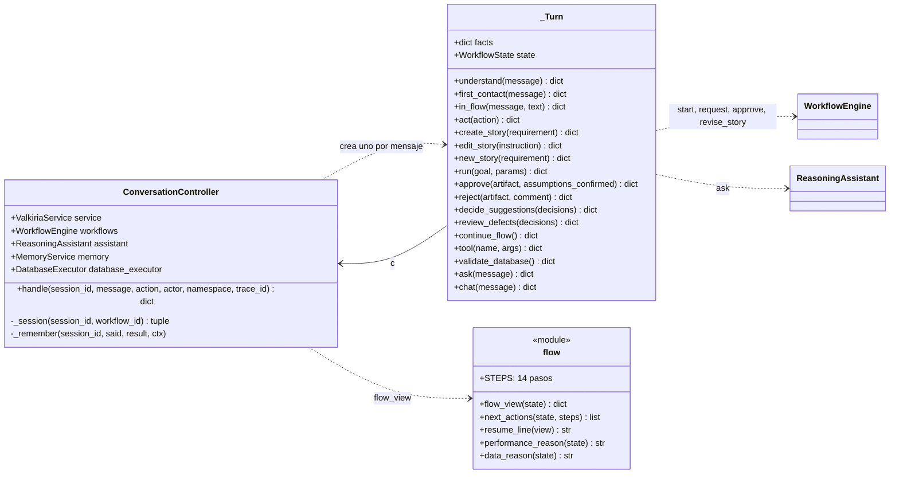

`_Turn` encapsula un turno: carga los `facts` de la sesión (flujo vigente, aclaración pendiente, división propuesta, último SQL) y el `WorkflowState`. Al terminar, `ConversationController._remember` guarda el turno y los `facts` en la memoria de corto plazo. La sesión es la única liga entre el chat y el flujo.

## 6. Asistente de razonamiento

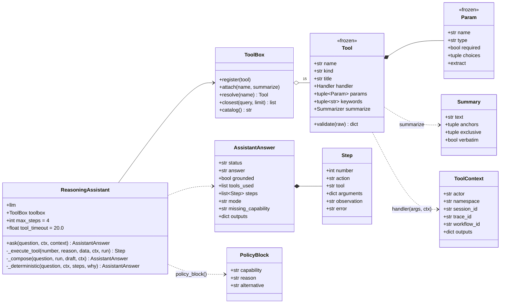

El catálogo (`assistant/catalog.py: build_toolbox`) es **cerrado**: 11 herramientas y 4 skills. Cada herramienta tiene un `Summarizer` que calcula en código la conclusión verificable. `faithful()` acepta la redacción del modelo solo si menciona los `anchors` y respeta los `exclusive`. Ver [Asistente](../asistente.md).

## 7. Memoria

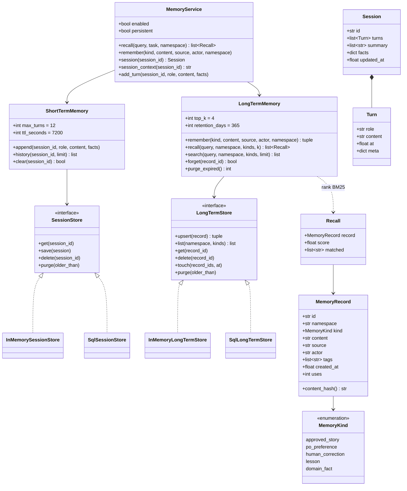

`KINDS_BY_TASK` filtra qué tipos de recuerdo recibe cada tarea; por ejemplo, el riesgo solo recibe `lesson` y `domain_fact`. La búsqueda es BM25 léxica con decaimiento por antigüedad (vida media de 90 días). Ver [Memoria](../memoria.md).

## 8. Puertos y adaptadores

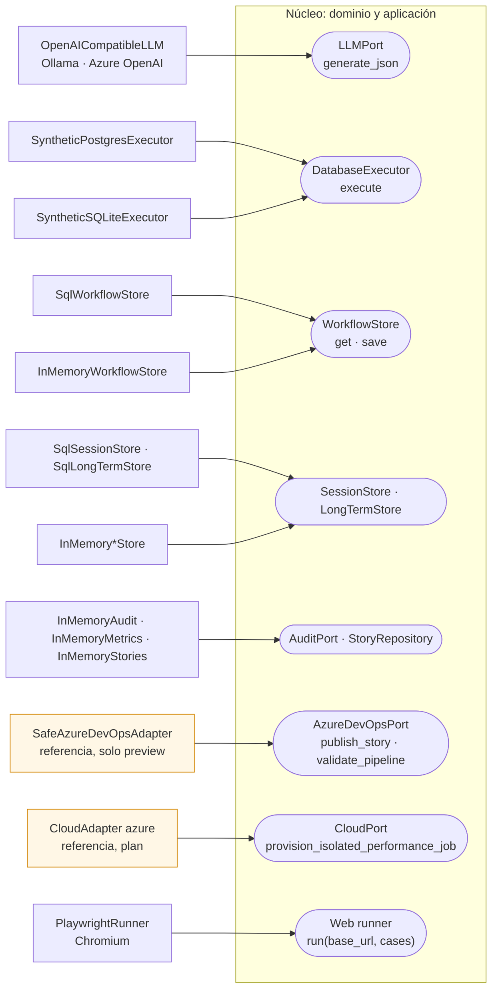

| Puerto | Adaptador por defecto | Adaptador alterno | Se elige con |
|---|---|---|---|
| `LLMPort` | `OpenAICompatibleLLM` → Ollama local | Mismo adaptador con `api-key` (endpoint administrado) | `VALKIRIA_LLM_BASE_URL`, `VALKIRIA_LLM_AUTH_HEADER` |
| `DatabaseExecutor` | `SyntheticSQLiteExecutor` (en memoria) | `SyntheticPostgresExecutor` | `VALKIRIA_DB_PROFILE=synthetic_postgresql` + URL |
| `WorkflowStore` | `InMemoryWorkflowStore` | `SqlWorkflowStore` (SQLite o PostgreSQL) | `VALKIRIA_WORKFLOW_DATABASE_URL` |
| `SessionStore`, `LongTermStore` | En memoria | SQL | `VALKIRIA_MEMORY_DATABASE_URL` o la de flujos |
| Web runner | Ninguno (no se ejecuta web) | `PlaywrightRunner` | `VALKIRIA_AUTOMATION_EXECUTE=true` |
| Auditoría, métricas, historias, lotes, reportes | En memoria | — (pendiente de persistencia durable) | — |

## 9. Modelo de datos persistente

### Base de control: flujos y memoria

Las tablas se crean al arrancar (`metadata.create_all`). El estado se guarda como JSON en una columna `TEXT`, sin ORM por entidad: el agregado completo se valida con Pydantic al leerse.

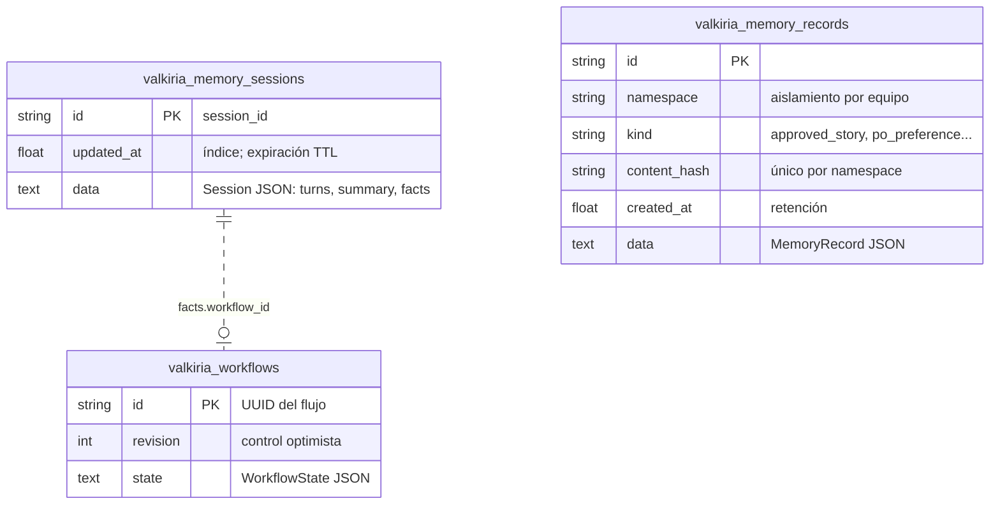

### Base sintética Nissan

`synthetic_db/migrations/V1__create_schema.sql` con datos ficticios en `V2__seed_nissan_data.sql`. La usan la app sintética, el ejecutor HU-011 y la etapa `DataValidation` del pipeline.

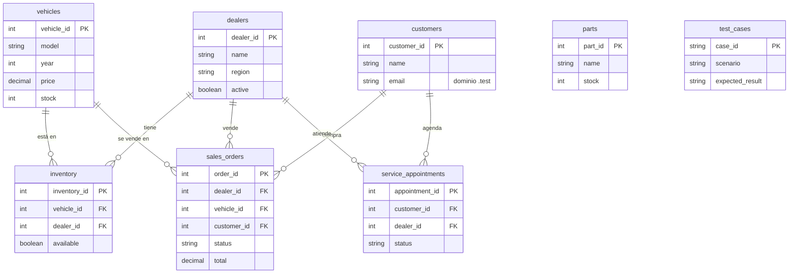

El esquema no declara llaves foráneas en el DDL; las relaciones son lógicas. Es intencional para una base de pruebas que se recrea, pero significa que la integridad referencial no la garantiza el motor.

### Almacenes en memoria (no persistentes)

`InMemoryAudit`, `InMemoryMetrics`, `InMemoryStories`, `InMemoryBatchStore`, `InMemoryExecutionStore` e `InMemoryReportStore` viven en el proceso de la API. Se pierden al reiniciar y no se comparten entre réplicas. Ver el riesgo [R-1](06-decisiones-calidad-riesgos.md#riesgos-y-deuda-técnica).
