# Vista de procesos

[← Índice de arquitectura](../arquitectura.md)

La vista de procesos describe Valkiria en ejecución:
- cómo colaboran los componentes en cada escenario;
- qué estados atraviesan los artefactos y los flujos;
- cómo se resuelve la concurrencia;
- cómo se contienen los fallos.

## Modelo de ejecución

| Proceso | Tecnología | Instancias | Modelo de concurrencia |
|---|---|---|---|
| API de Valkiria | Uvicorn + FastAPI (`create_app`) | 1 en Compose y kind; 2 réplicas en AKS | Un bucle `asyncio` por proceso. Las llamadas HTTP (LLM, app sintética) son asíncronas con `httpx`. El SQL síncrono (SQLAlchemy) corre en hilos con `asyncio.to_thread` |
| App Nissan sintética | Uvicorn + FastAPI (`create_synthetic_app`) | 1 | Peticiones independientes contra PostgreSQL |
| Chromium (opcional) | Playwright async dentro del proceso de la API | 1 navegador por ejecución | Casos secuenciales; un contexto por caso |
| Ollama | Servidor de modelos | 1 | `OLLAMA_NUM_PARALLEL=4` peticiones simultáneas |
| PostgreSQL | Servidor | 1 | Transacciones por ejecución; `READ ONLY` en el pipeline |
| Pipeline de Azure DevOps | Agentes hospedados | Por corrida | Etapas `Test` y `DataValidation` en paralelo; `ReportToValkiria` al final |

## Ciclo de vida de una petición HTTP

Todas las rutas pasan por el mismo middleware y los mismos manejadores de errores (`api/app.py`).

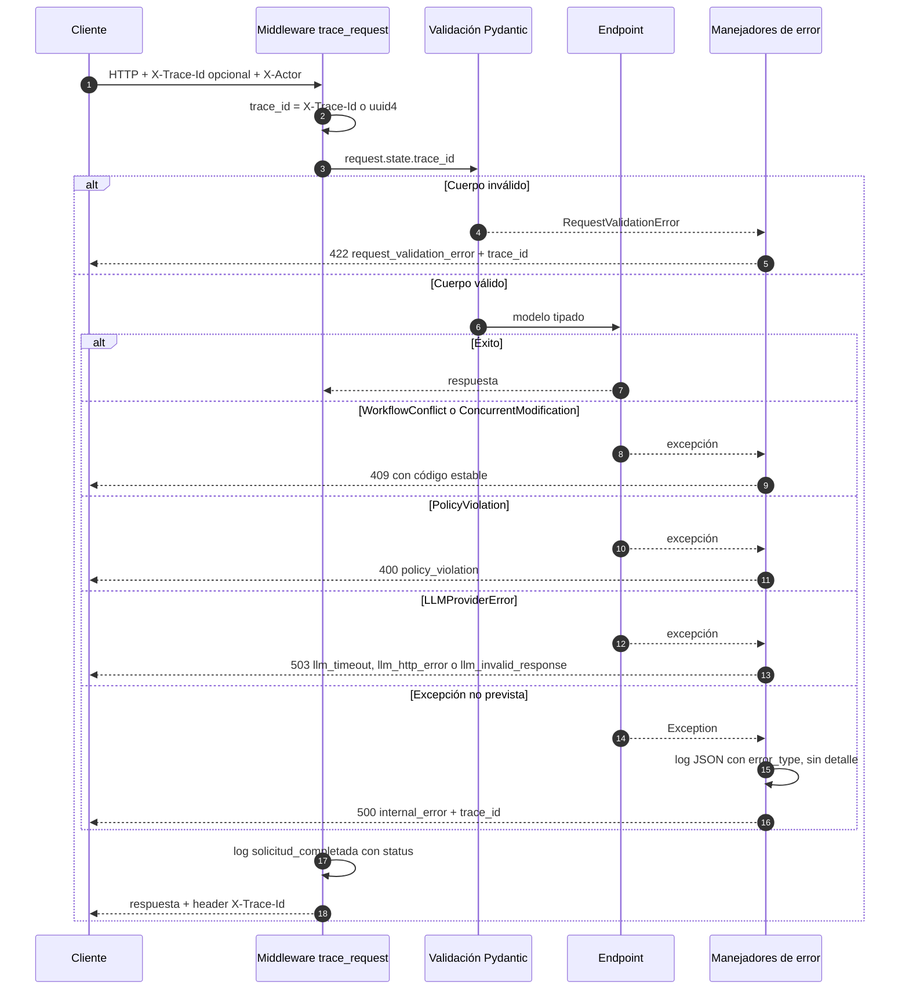
```mermaid
sequenceDiagram
    autonumber
    participant C as Cliente
    participant MW as Middleware trace_request
    participant V as Validación Pydantic
    participant H as Endpoint
    participant EH as Manejadores de error
    C->>MW: HTTP + X-Trace-Id opcional + X-Actor
    MW->>MW: trace_id = X-Trace-Id o uuid4
    MW->>V: request.state.trace_id
    alt Cuerpo inválido
        V-->>EH: RequestValidationError
        EH-->>C: 422 request_validation_error + trace_id
    else Cuerpo válido
        V->>H: modelo tipado
        alt Éxito
            H-->>MW: respuesta
        else WorkflowConflict o ConcurrentModification
            H-->>EH: excepción
            EH-->>C: 409 con código estable
        else PolicyViolation
            H-->>EH: excepción
            EH-->>C: 400 policy_violation
        else LLMProviderError
            H-->>EH: excepción
            EH-->>C: 503 llm_timeout, llm_http_error o llm_invalid_response
        else Excepción no prevista
            H-->>EH: Exception
            EH->>EH: log JSON con error_type, sin detalle
            EH-->>C: 500 internal_error + trace_id
        end
        MW->>MW: log solicitud_completada con status
        MW-->>C: respuesta + header X-Trace-Id
    end
```

`/v1/chat` es la excepción deliberada: atrapa `LLMProviderError`, `TimeoutError` y cualquier otra excepción, y responde **200** con `intent: "error"`, `retryable: true` y el `trace_id`. La conversación nunca se rompe (RT-04).

## P-1 Orquestación multiagente de una petición

Escenario E10. `POST /v1/agent/execute` → `MultiAgentOrchestrator.run`.

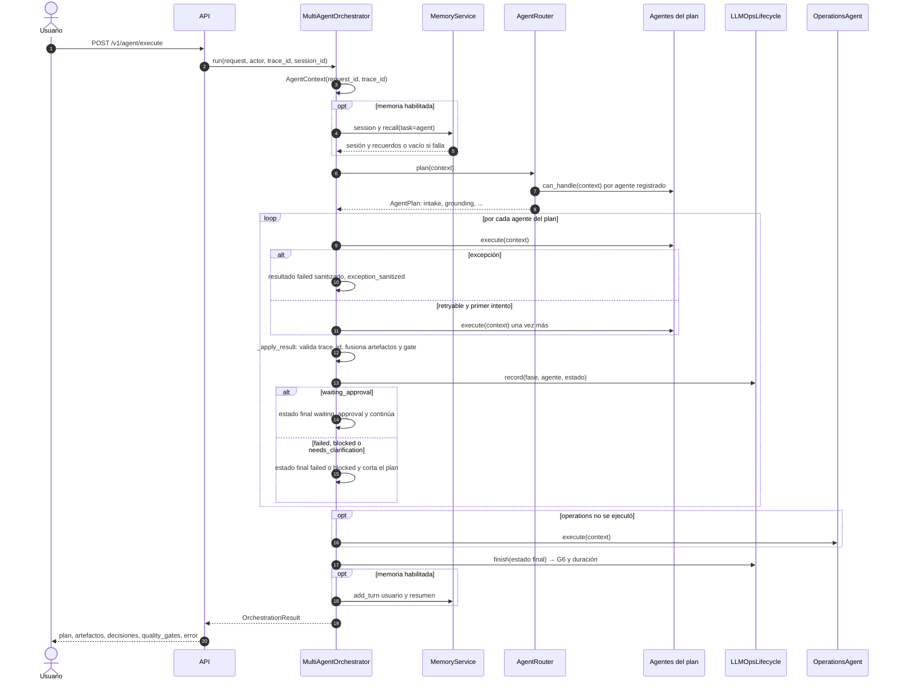
```mermaid
sequenceDiagram
    autonumber
    actor U as Usuario
    participant API as API
    participant O as MultiAgentOrchestrator
    participant M as MemoryService
    participant R as AgentRouter
    participant A as Agentes del plan
    participant L as LLMOpsLifecycle
    participant OP as OperationsAgent

    U->>API: POST /v1/agent/execute
    API->>O: run(request, actor, trace_id, session_id)
    O->>O: AgentContext(request_id, trace_id)
    opt memoria habilitada
        O->>M: session y recall(task=agent)
        M-->>O: sesión y recuerdos o vacío si falla
    end
    O->>R: plan(context)
    R->>A: can_handle(context) por agente registrado
    R-->>O: AgentPlan: intake, grounding, ...
    loop por cada agente del plan
        O->>A: execute(context)
        alt excepción
            O->>O: resultado failed sanitizado, exception_sanitized
        else retryable y primer intento
            O->>A: execute(context) una vez más
        end
        O->>O: _apply_result: valida trace_id, fusiona artefactos y gate
        O->>L: record(fase, agente, estado)
        alt waiting_approval
            O->>O: estado final waiting_approval y continúa
        else failed, blocked o needs_clarification
            O->>O: estado final failed o blocked y corta el plan
        end
    end
    opt operations no se ejecutó
        O->>OP: execute(context)
    end
    O->>L: finish(estado final) → G6 y duración
    opt memoria habilitada
        O->>M: add_turn usuario y resumen
    end
    O-->>API: OrchestrationResult
    API-->>U: plan, artefactos, decisiones, quality_gates, error
```

`OperationsAgent` corre siempre, incluso después de un bloqueo, para que la auditoría quede completa. Un handoff con `trace_id` distinto lanza `RuntimeError`: se interpreta como corrupción del contexto, no como un fallo del agente.

## P-2 Mensaje en el chat hasta un paso del flujo

Escenario E1. `POST /v1/chat` → `ConversationController.handle`.

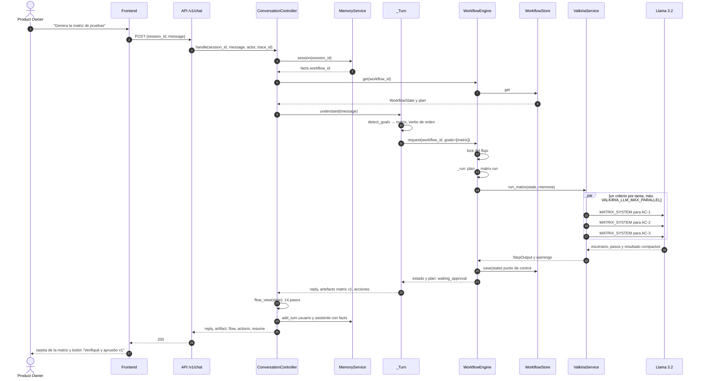
```mermaid
sequenceDiagram
    autonumber
    actor PO as Product Owner
    participant FE as Frontend
    participant API as API /v1/chat
    participant CC as ConversationController
    participant MEM as MemoryService
    participant T as _Turn
    participant WE as WorkflowEngine
    participant ST as WorkflowStore
    participant SVC as ValkiriaService
    participant LLM as Llama 3.2

    PO->>FE: "Genera la matriz de pruebas"
    FE->>API: POST {session_id, message}
    API->>CC: handle(session_id, message, actor, trace_id)
    CC->>MEM: session(session_id)
    MEM-->>CC: facts.workflow_id
    CC->>WE: get(workflow_id)
    WE->>ST: get
    ST-->>CC: WorkflowState y plan
    CC->>T: understand(message)
    T->>T: detect_goals → matrix, verbo de orden
    T->>WE: request(workflow_id, goals=[matrix])
    WE->>WE: lock del flujo
    WE->>WE: _run: plan → matrix run
    WE->>SVC: run_matrix(state, memoria)
    par un criterio por tarea, máx. VALKIRIA_LLM_MAX_PARALLEL
        SVC->>LLM: MATRIX_SYSTEM para AC-1
        SVC->>LLM: MATRIX_SYSTEM para AC-2
        SVC->>LLM: MATRIX_SYSTEM para AC-3
    end
    LLM-->>SVC: escenario, pasos y resultado compactos
    SVC-->>WE: StepOutput y warnings
    WE->>ST: save(state) punto de control
    WE-->>T: estado y plan: waiting_approval
    T-->>CC: reply, artefacto matrix v1, acciones
    CC->>CC: flow_view(state): 14 pasos
    CC->>MEM: add_turn usuario y asistente con facts
    CC-->>API: reply, artifact, flow, actions, resume
    API-->>FE: 200
    FE-->>PO: tarjeta de la matriz y botón "Verifiqué y apruebo v1"
```

### Cómo decide el conductor qué hacer con un mensaje

`_Turn.understand` y `_Turn.in_flow` son reglas deterministas, evaluadas en este orden:

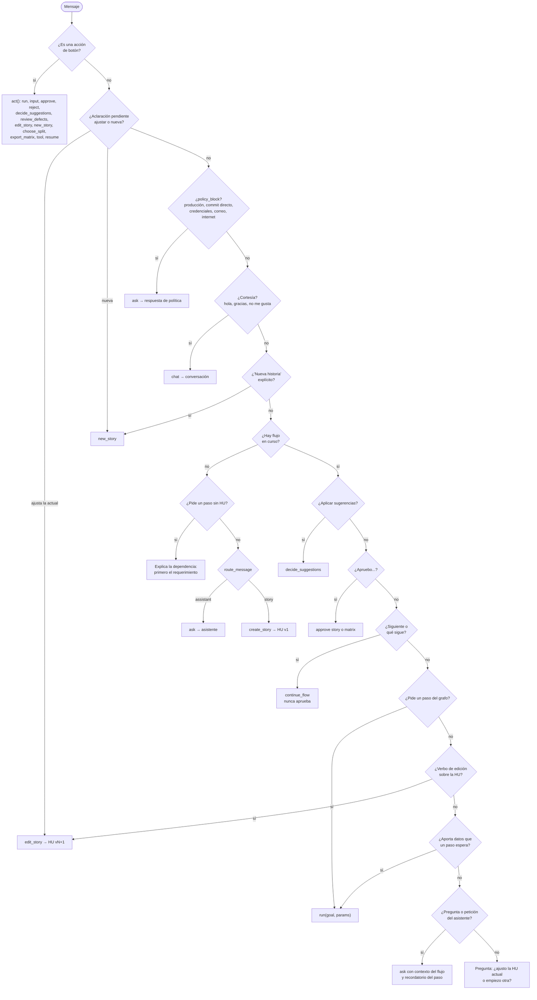
```mermaid
flowchart TD
    M(["Mensaje"]) --> ACT{"¿Es una acción<br/>de botón?"}
    ACT -- sí --> DO["act(): run, input, approve, reject,<br/>decide_suggestions, review_defects,<br/>edit_story, new_story, choose_split,<br/>export_matrix, tool, resume"]
    ACT -- no --> PEND{"¿Aclaración pendiente<br/>ajustar o nueva?"}
    PEND -- "ajusta la actual" --> EDIT["edit_story → HU vN+1"]
    PEND -- "nueva" --> NEW["new_story"]
    PEND -- no --> POL{"¿policy_block?<br/>producción, commit directo,<br/>credenciales, correo, internet"}
    POL -- sí --> ASKP["ask → respuesta de política"]
    POL -- no --> CORT{"¿Cortesía?<br/>hola, gracias, no me gusta"}
    CORT -- sí --> CHAT["chat → conversación"]
    CORT -- no --> NS{"¿'Nueva historia'<br/>explícito?"}
    NS -- sí --> NEW
    NS -- no --> HAS{"¿Hay flujo<br/>en curso?"}
    HAS -- no --> FC{"¿Pide un paso sin HU?"}
    FC -- sí --> DEP["Explica la dependencia:<br/>primero el requerimiento"]
    FC -- no --> RT1{"route_message"}
    RT1 -- assistant --> ASK["ask → asistente"]
    RT1 -- story --> CREATE["create_story → HU v1"]
    HAS -- sí --> SUG{"¿Aplicar sugerencias?"}
    SUG -- sí --> DEC["decide_suggestions"]
    SUG -- no --> APR{"¿Apruebo...?"}
    APR -- sí --> APPROVE["approve story o matrix"]
    APR -- no --> CONT{"¿Siguiente o<br/>qué sigue?"}
    CONT -- sí --> NEXT["continue_flow<br/>nunca aprueba"]
    CONT -- no --> STEP{"¿Pide un paso del grafo?"}
    STEP -- sí --> RUN["run(goal, params)"]
    STEP -- no --> ED{"¿Verbo de edición<br/>sobre la HU?"}
    ED -- sí --> EDIT
    ED -- no --> INP{"¿Aporta datos que<br/>un paso espera?"}
    INP -- sí --> RUN
    INP -- no --> Q{"¿Pregunta o petición<br/>del asistente?"}
    Q -- sí --> ASK2["ask con contexto del flujo<br/>y recordatorio del paso"]
    Q -- no --> CLAR["Pregunta: ¿ajusto la HU actual<br/>o empiezo otra?"]
```

## P-3 Motor de flujo: planificar, ejecutar y guardar

`WorkflowEngine._run` es el único bucle que ejecuta capacidades. Lo invocan `start`, `request`, `approve`, `edit`, `resume`, `adopt_story`, `revise_story` y `record_pipeline_results`, siempre dentro del bloqueo del flujo.

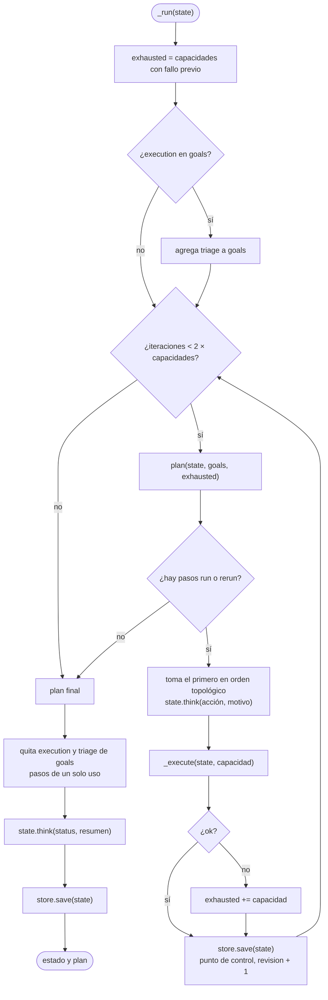
```mermaid
flowchart TD
    S(["_run(state)"]) --> EX["exhausted = capacidades con fallo previo"]
    EX --> TG{"¿execution en goals?"}
    TG -- sí --> ADDT["agrega triage a goals"]
    TG -- no --> LOOP
    ADDT --> LOOP{"¿iteraciones < 2 × capacidades?"}
    LOOP -- no --> FIN
    LOOP -- sí --> PL["plan(state, goals, exhausted)"]
    PL --> RN{"¿hay pasos run o rerun?"}
    RN -- no --> FIN
    RN -- sí --> FIRST["toma el primero en orden topológico<br/>state.think(acción, motivo)"]
    FIRST --> EXE["_execute(state, capacidad)"]
    EXE --> OK{"¿ok?"}
    OK -- no --> ADDX["exhausted += capacidad"]
    OK -- sí --> SAVE
    ADDX --> SAVE["store.save(state)<br/>punto de control, revision + 1"]
    SAVE --> LOOP
    FIN["plan final"] --> OS["quita execution y triage de goals<br/>pasos de un solo uso"]
    OS --> SUM["state.think(status, resumen)"]
    SUM --> SV2["store.save(state)"]
    SV2 --> R(["estado y plan"])
```

### `_execute`: generar con reintentos, memoria y registro

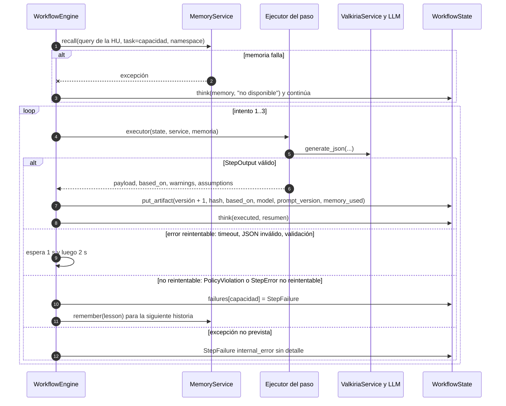
```mermaid
sequenceDiagram
    autonumber
    participant E as WorkflowEngine
    participant M as MemoryService
    participant X as Ejecutor del paso
    participant S as ValkiriaService y LLM
    participant W as WorkflowState

    E->>M: recall(query de la HU, task=capacidad, namespace)
    alt memoria falla
        M--xE: excepción
        E->>W: think(memory, "no disponible") y continúa
    end
    loop intento 1..3
        E->>X: executor(state, service, memoria)
        X->>S: generate_json(...)
        alt StepOutput válido
            X-->>E: payload, based_on, warnings, assumptions
            E->>W: put_artifact(versión + 1, hash, based_on, model, prompt_version, memory_used)
            E->>W: think(executed, resumen)
        else error reintentable: timeout, JSON inválido, validación
            E->>E: espera 1 s y luego 2 s
        else no reintentable: PolicyViolation o StepError no reintentable
            E->>W: failures[capacidad] = StepFailure
            E->>M: remember(lesson) para la siguiente historia
        else excepción no prevista
            E->>W: StepFailure internal_error sin detalle
        end
    end
```

### Calidad de la salida del LLM

Cada ejecutor aplica el mismo patrón: **generar → validar contra las reglas de la HU → pedir una corrección concreta → completar de forma determinista y declararlo**.

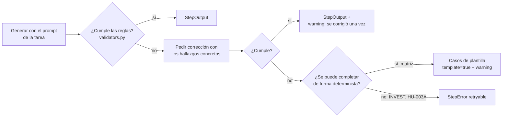
```mermaid
flowchart LR
    G["Generar con el prompt<br/>de la tarea"] --> V{"¿Cumple las reglas?<br/>validators.py"}
    V -- sí --> OUT["StepOutput"]
    V -- no --> C["Pedir corrección con<br/>los hallazgos concretos"]
    C --> V2{"¿Cumple?"}
    V2 -- sí --> W1["StepOutput +<br/>warning: se corrigió una vez"]
    V2 -- no --> D{"¿Se puede completar<br/>de forma determinista?"}
    D -- "sí: matriz" --> T["Casos de plantilla<br/>template=true + warning"]
    D -- "no: INVEST, HU-003A" --> F["StepError retryable"]
```

| Capacidad | Validación | Corrección | Último recurso |
|---|---|---|---|
| INVEST | 6 criterios, estado válido, justificación y sugerencia si es `parcial` o `no_cumple` | Una, con los hallazgos | `StepError invest_invalid` (reintentable) |
| Matriz | Positivo, negativo y borde por criterio; máximo 30; vínculo a criterio | Se regeneran solo los criterios incompletos | Plantilla declarada; si todo es plantilla, `llm_unavailable` |
| Matriz con más de 10 criterios | Regla 2 de HU-004 | — | `matrix_requires_split` (no reintentable) |
| HU-003A | Esquema completo de `UserStory` | — | `story_revision_invalid` (reintentable) |
| Consultas HU-011 | `SELECT` de solo lectura, análisis estático y prueba en la base sintética | Una, con el error del motor | La consulta queda `inválida` y no se ejecuta |

## P-4 Asistente de razonamiento con herramientas

Escenarios E2 y E9. `ReasoningAssistant.ask`: ciclo decidir → ejecutar → observar, con verificaciones en código.

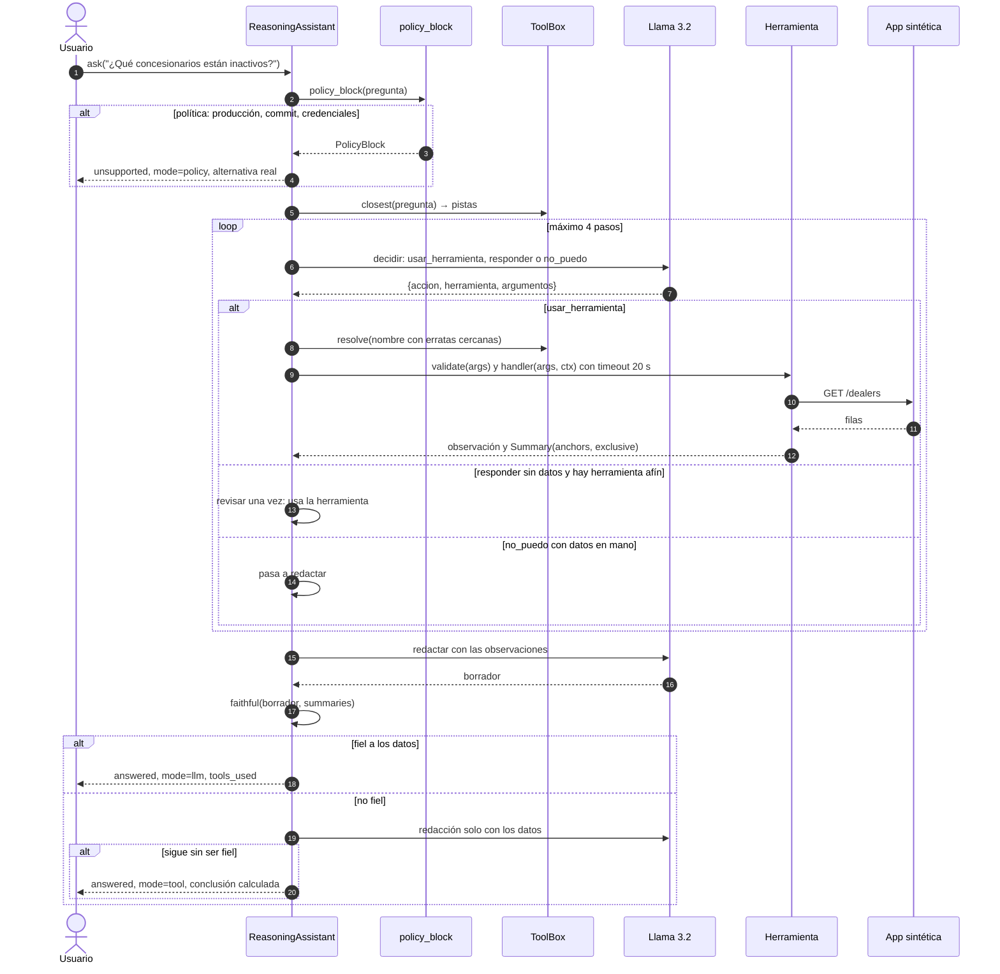
```mermaid
sequenceDiagram
    autonumber
    actor U as Usuario
    participant RA as ReasoningAssistant
    participant P as policy_block
    participant TB as ToolBox
    participant LLM as Llama 3.2
    participant T as Herramienta
    participant SA as App sintética

    U->>RA: ask("¿Qué concesionarios están inactivos?")
    RA->>P: policy_block(pregunta)
    alt política: producción, commit, credenciales
        P-->>RA: PolicyBlock
        RA-->>U: unsupported, mode=policy, alternativa real
    end
    RA->>TB: closest(pregunta) → pistas
    loop máximo 4 pasos
        RA->>LLM: decidir: usar_herramienta, responder o no_puedo
        LLM-->>RA: {accion, herramienta, argumentos}
        alt usar_herramienta
            RA->>TB: resolve(nombre con erratas cercanas)
            RA->>T: validate(args) y handler(args, ctx) con timeout 20 s
            T->>SA: GET /dealers
            SA-->>T: filas
            T-->>RA: observación y Summary(anchors, exclusive)
        else responder sin datos y hay herramienta afín
            RA->>RA: revisar una vez: usa la herramienta
        else no_puedo con datos en mano
            RA->>RA: pasa a redactar
        end
    end
    RA->>LLM: redactar con las observaciones
    LLM-->>RA: borrador
    RA->>RA: faithful(borrador, summaries)
    alt fiel a los datos
        RA-->>U: answered, mode=llm, tools_used
    else no fiel
        RA->>LLM: redacción solo con los datos
        alt sigue sin ser fiel
            RA-->>U: answered, mode=tool, conclusión calculada
        end
    end
```

## P-5 Ejecución unificada (HU-010) y revisión de fallos

Escenario E6. Solo se ejecuta lo **aprobado**: scripts (`automation`) y consultas (`data_validation`).

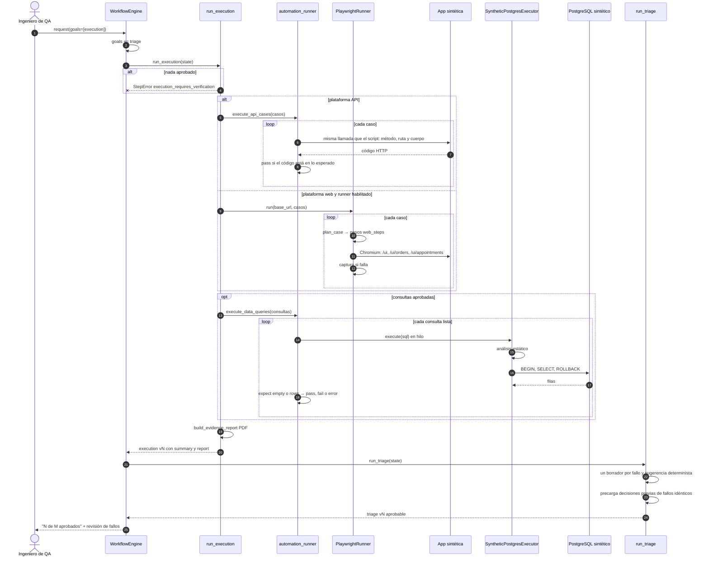
```mermaid
sequenceDiagram
    autonumber
    actor QA as Ingeniero de QA
    participant WE as WorkflowEngine
    participant RE as run_execution
    participant AR as automation_runner
    participant PW as PlaywrightRunner
    participant SA as App sintética
    participant DB as SyntheticPostgresExecutor
    participant PG as PostgreSQL sintético
    participant TR as run_triage

    QA->>WE: request(goals=[execution])
    WE->>WE: goals += triage
    WE->>RE: run_execution(state)
    alt nada aprobado
        RE--xWE: StepError execution_requires_verification
    end
    alt plataforma API
        RE->>AR: execute_api_cases(casos)
        loop cada caso
            AR->>SA: misma llamada que el script: método, ruta y cuerpo
            SA-->>AR: código HTTP
            AR->>AR: pass si el código está en lo esperado
        end
    else plataforma web y runner habilitado
        RE->>PW: run(base_url, casos)
        loop cada caso
            PW->>PW: plan_case → pasos web_steps
            PW->>SA: Chromium: /ui, /ui/orders, /ui/appointments
            PW->>PW: captura si falla
        end
    end
    opt consultas aprobadas
        RE->>AR: execute_data_queries(consultas)
        loop cada consulta lista
            AR->>DB: execute(sql) en hilo
            DB->>DB: análisis estático
            DB->>PG: BEGIN, SELECT, ROLLBACK
            PG-->>DB: filas
            AR->>AR: expect empty o rows → pass, fail o error
        end
    end
    RE->>RE: build_evidence_report PDF
    RE-->>WE: execution vN con summary y report
    WE->>TR: run_triage(state)
    TR->>TR: un borrador por fallo y sugerencia determinista
    TR->>TR: precarga decisiones previas de fallos idénticos
    TR-->>WE: triage vN aprobable
    WE-->>QA: "N de M aprobados" + revisión de fallos
```

`execution` y `triage` son de **un solo uso**: salen de los objetivos después de correr. Si cambian los scripts o las consultas, la ejecución queda desactualizada, pero no se repite sola, porque ejecutar tiene efectos en un ambiente.

## P-6 Aprobación humana (RT-02)

Escenarios E1 y E4.

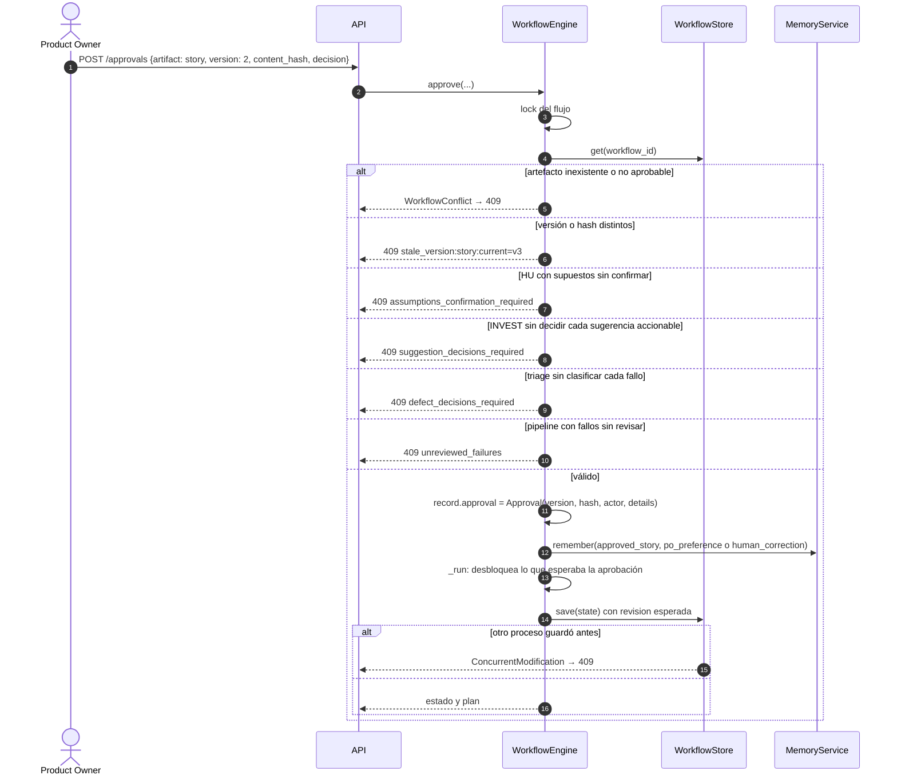
```mermaid
sequenceDiagram
    autonumber
    actor PO as Product Owner
    participant API as API
    participant WE as WorkflowEngine
    participant ST as WorkflowStore
    participant M as MemoryService

    PO->>API: POST /approvals {artifact: story, version: 2, content_hash, decision}
    API->>WE: approve(...)
    WE->>WE: lock del flujo
    WE->>ST: get(workflow_id)
    alt artefacto inexistente o no aprobable
        WE-->>API: WorkflowConflict → 409
    else versión o hash distintos
        WE-->>API: 409 stale_version:story:current=v3
    else HU con supuestos sin confirmar
        WE-->>API: 409 assumptions_confirmation_required
    else INVEST sin decidir cada sugerencia accionable
        WE-->>API: 409 suggestion_decisions_required
    else triage sin clasificar cada fallo
        WE-->>API: 409 defect_decisions_required
    else pipeline con fallos sin revisar
        WE-->>API: 409 unreviewed_failures
    else válido
        WE->>WE: record.approval = Approval(version, hash, actor, details)
        WE->>M: remember(approved_story, po_preference o human_correction)
        WE->>WE: _run: desbloquea lo que esperaba la aprobación
        WE->>ST: save(state) con revision esperada
        alt otro proceso guardó antes
            ST-->>API: ConcurrentModification → 409
        else
            WE-->>API: estado y plan
        end
    end
```

## P-7 Ida y vuelta con el pipeline de Azure DevOps

Escenario E7. El YAML generado en HU-007 ejecuta lo mismo que Valkiria y devuelve los resultados.

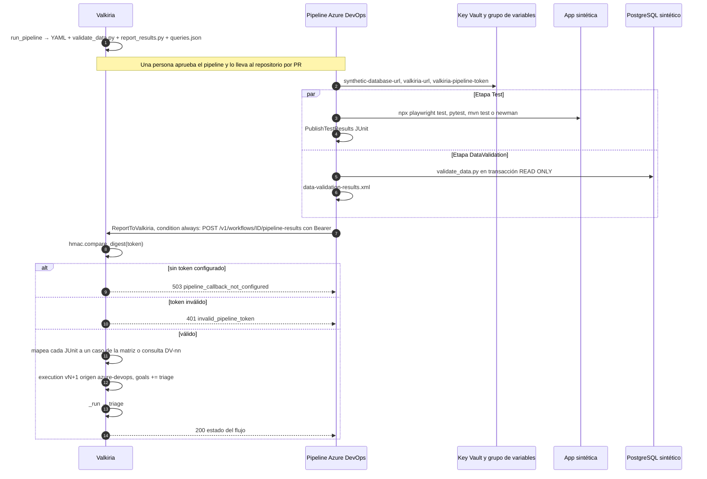
```mermaid
sequenceDiagram
    autonumber
    participant V as Valkiria
    participant ADO as Pipeline Azure DevOps
    participant KV as Key Vault y grupo de variables
    participant SA as App sintética
    participant PG as PostgreSQL sintético

    V->>V: run_pipeline → YAML + validate_data.py + report_results.py + queries.json
    Note over V,ADO: Una persona aprueba el pipeline y lo lleva al repositorio por PR
    ADO->>KV: synthetic-database-url, valkiria-url, valkiria-pipeline-token
    par Etapa Test
        ADO->>SA: npx playwright test, pytest, mvn test o newman
        ADO->>ADO: PublishTestResults JUnit
    and Etapa DataValidation
        ADO->>PG: validate_data.py en transacción READ ONLY
        ADO->>ADO: data-validation-results.xml
    end
    ADO->>V: ReportToValkiria, condition always: POST /v1/workflows/ID/pipeline-results con Bearer
    V->>V: hmac.compare_digest(token)
    alt sin token configurado
        V-->>ADO: 503 pipeline_callback_not_configured
    else token inválido
        V-->>ADO: 401 invalid_pipeline_token
    else válido
        V->>V: mapea cada JUnit a un caso de la matriz o consulta DV-nn
        V->>V: execution vN+1 origen azure-devops, goals += triage
        V->>V: _run → triage
        V-->>ADO: 200 estado del flujo
    end
```

## P-8 Manejo de errores y reintentos

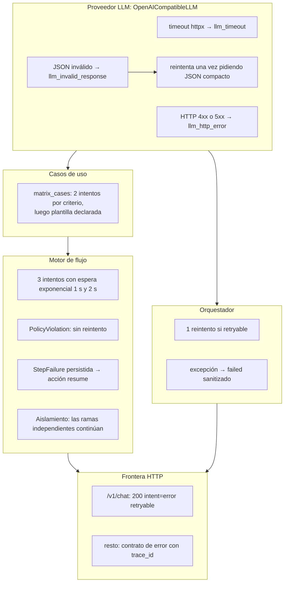
```mermaid
flowchart TB
    subgraph LLM["Proveedor LLM: OpenAICompatibleLLM"]
        L1["timeout httpx → llm_timeout"]
        L2["HTTP 4xx o 5xx → llm_http_error"]
        L3["JSON inválido → llm_invalid_response"]
        L3 --> L4["reintenta una vez pidiendo JSON compacto"]
    end
    subgraph SVC["Casos de uso"]
        S1["matrix_cases: 2 intentos por criterio,<br/>luego plantilla declarada"]
    end
    subgraph ENG["Motor de flujo"]
        E1["3 intentos con espera exponencial 1 s y 2 s"]
        E2["PolicyViolation: sin reintento"]
        E3["StepFailure persistida → acción resume"]
        E4["Aislamiento: las ramas independientes continúan"]
    end
    subgraph ORC["Orquestador"]
        O1["1 reintento si retryable"]
        O2["excepción → failed sanitizado"]
    end
    subgraph EDGE["Frontera HTTP"]
        H1["/v1/chat: 200 intent=error retryable"]
        H2["resto: contrato de error con trace_id"]
    end
    LLM --> SVC --> ENG --> EDGE
    LLM --> ORC --> EDGE
```

| Falla | Dónde se detecta | Reacción | Lo que ve el usuario |
|---|---|---|---|
| Ollama no responde en 60 s | `OpenAICompatibleLLM` | `llm_timeout` → reintentos del motor | Paso `failed` con acción "Reintentar", o mensaje reintentable en el chat |
| JSON truncado | Proveedor | Un reintento con JSON compacto | Transparente, o error reintentable |
| Salida que no cumple la HU | `validators.py` | Corrección o plantilla | `warnings` en el artefacto |
| Memoria no disponible | Motor, orquestador, conductor | Continúan sin memoria | Razonamiento: "memoria no disponible" |
| SQL peligroso | Análisis estático | Bloqueo antes de conectar | `status: blocked` con hallazgos |
| Error del driver SQL | Ejecutor | Rollback y error sanitizado | `synthetic_database_error` y tipo de error |
| Chromium no disponible | `run_execution` | `web_execution_unavailable` | Propuesta de regenerar con un stack de API |
| Escritura concurrente | `SqlWorkflowStore` | `ConcurrentModification` | `409`: volver a consultar |

## P-9 Ejecución segura de SQL (HU-011)

Escenario E8. `SyntheticPostgresExecutor.execute`.

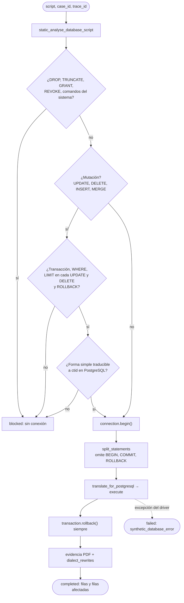
```mermaid
flowchart TD
    IN(["script, case_id, trace_id"]) --> SA["static_analyse_database_script"]
    SA --> BL{"¿DROP, TRUNCATE, GRANT,<br/>REVOKE, comandos del sistema?"}
    BL -- sí --> BLOCK["blocked: sin conexión"]
    BL -- no --> MUT{"¿Mutación?<br/>UPDATE, DELETE, INSERT, MERGE"}
    MUT -- sí --> CTRL{"¿Transacción, WHERE,<br/>LIMIT en cada UPDATE y DELETE<br/>y ROLLBACK?"}
    CTRL -- no --> BLOCK
    CTRL -- sí --> PGL{"¿Forma simple traducible<br/>a ctid en PostgreSQL?"}
    PGL -- no --> BLOCK
    PGL -- sí --> RUN
    MUT -- no --> RUN["connection.begin()"]
    RUN --> SPLIT["split_statements<br/>omite BEGIN, COMMIT, ROLLBACK"]
    SPLIT --> EXEC["translate_for_postgresql → execute"]
    EXEC --> RB["transaction.rollback() siempre"]
    RB --> REP["evidencia PDF + dialect_rewrites"]
    REP --> OK(["completed: filas y filas afectadas"])
    EXEC -. "excepción del driver" .-> ERR(["failed: synthetic_database_error"])
```

## Máquinas de estado

### Artefacto del flujo (`ArtifactRecord`)

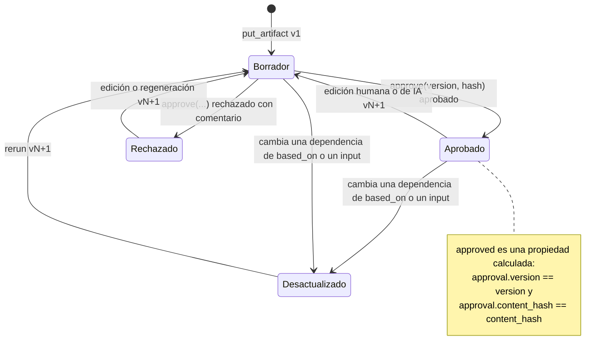
```mermaid
stateDiagram-v2
    [*] --> Borrador: put_artifact v1
    Borrador --> Aprobado: approve(version, hash) aprobado
    Borrador --> Rechazado: approve(...) rechazado con comentario
    Aprobado --> Desactualizado: cambia una dependencia de based_on o un input
    Borrador --> Desactualizado: cambia una dependencia de based_on o un input
    Rechazado --> Borrador: edición o regeneración vN+1
    Desactualizado --> Borrador: rerun vN+1
    Aprobado --> Borrador: edición humana o de IA vN+1
    note right of Aprobado
        approved es una propiedad calculada:
        approval.version == version y
        approval.content_hash == content_hash
    end note
```

### Estado del flujo (`WorkflowPlan.status`)

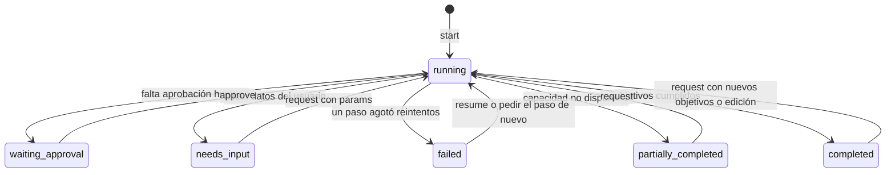
```mermaid
stateDiagram-v2
    [*] --> running: start
    running --> waiting_approval: falta aprobación humana
    running --> needs_input: faltan datos del usuario
    running --> failed: un paso agotó reintentos
    running --> partially_completed: capacidad no disponible
    running --> completed: objetivos cumplidos
    waiting_approval --> running: approve
    needs_input --> running: request con params
    failed --> running: resume o pedir el paso de nuevo
    completed --> running: request con nuevos objetivos o edición
    partially_completed --> running: request
```

`running` es transitorio: solo existe dentro de `_run`. Una respuesta HTTP siempre devuelve uno de los otros cinco estados.

### Petición en el orquestador

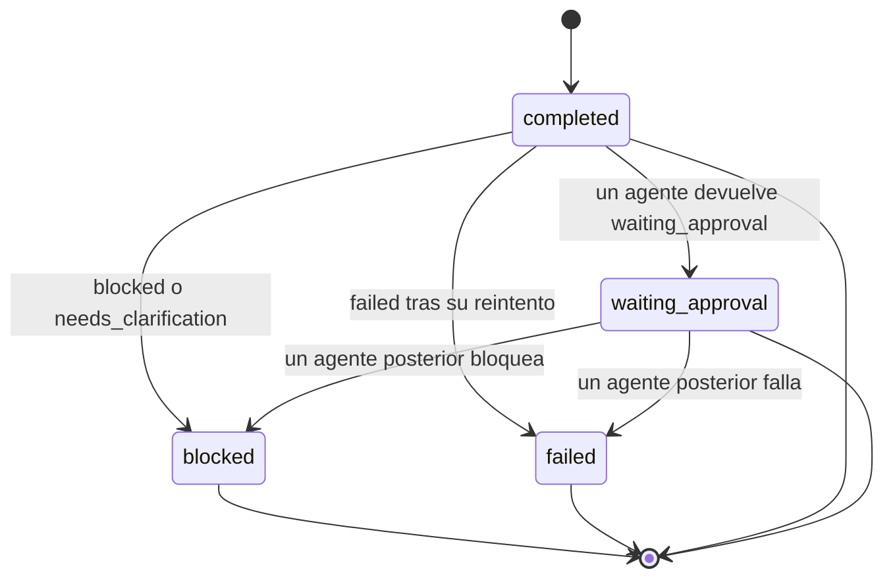
```mermaid
stateDiagram-v2
    [*] --> completed
    completed --> waiting_approval: un agente devuelve waiting_approval
    completed --> blocked: blocked o needs_clarification
    completed --> failed: failed tras su reintento
    waiting_approval --> blocked: un agente posterior bloquea
    waiting_approval --> failed: un agente posterior falla
    blocked --> [*]
    failed --> [*]
    completed --> [*]
    waiting_approval --> [*]
```

### Fallo en la revisión de fallos (triage)

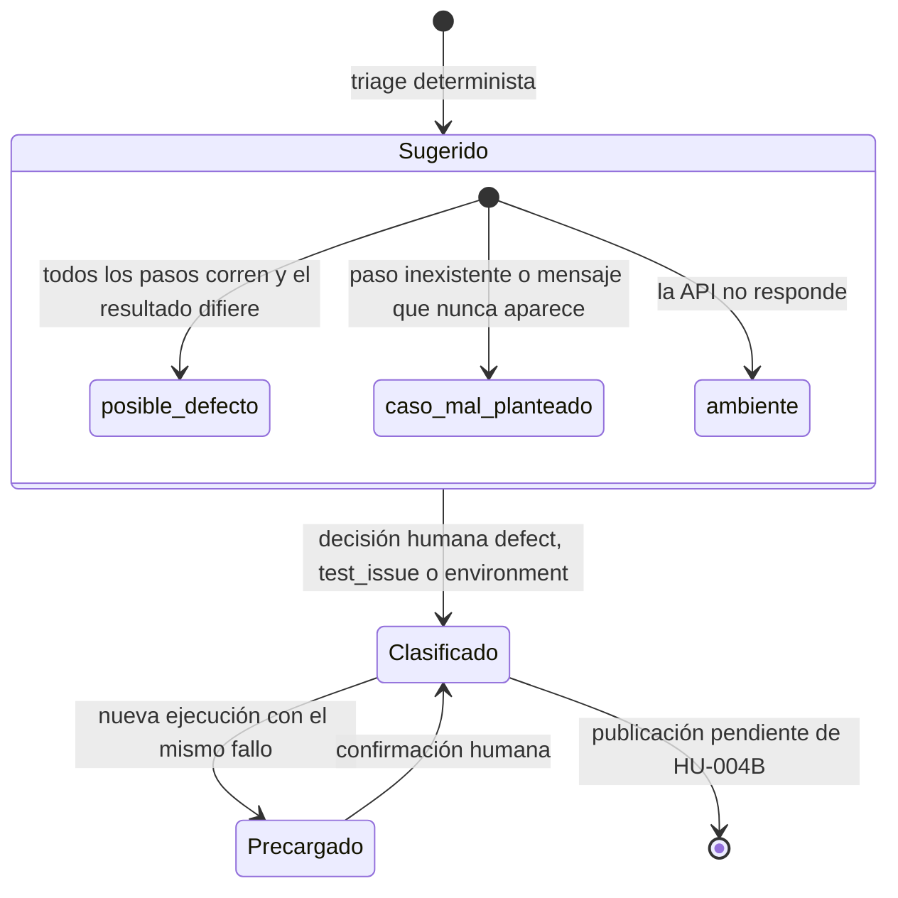
```mermaid
stateDiagram-v2
    [*] --> Sugerido: triage determinista
    state Sugerido {
        [*] --> posible_defecto: todos los pasos corren y el resultado difiere
        [*] --> caso_mal_planteado: paso inexistente o mensaje que nunca aparece
        [*] --> ambiente: la API no responde
    }
    Sugerido --> Clasificado: decisión humana defect, test_issue o environment
    Clasificado --> Precargado: nueva ejecución con el mismo fallo
    Precargado --> Clasificado: confirmación humana
    Clasificado --> [*]: publicación pendiente de HU-004B
```

## Concurrencia y consistencia

| Mecanismo | Alcance | Protege contra |
|---|---|---|
| `asyncio.Lock` por `workflow_id` (`WorkflowEngine._lock`) | Un proceso | Dos peticiones simultáneas al mismo flujo en la misma réplica |
| Control optimista por `revision` (`SqlWorkflowStore._save`: `UPDATE … WHERE revision = esperada`) | Todas las réplicas | Escrituras perdidas entre réplicas → `409` |
| `asyncio.Semaphore(VALKIRIA_LLM_MAX_PARALLEL)` en `ValkiriaService` | Un proceso | Saturar Ollama al generar la matriz por criterio |
| `threading.RLock` en `SyntheticSQLiteExecutor` | Un proceso | Uso concurrente de la conexión SQLite compartida |
| Transacción con `rollback` siempre | Cada ejecución SQL | Efectos persistentes en la base sintética |
| Clave de idempotencia (`case_id` + `script`) con caché de resultados | Ejecutor SQLite | Repetir la misma ejecución |
| `idempotency_key` del Work Item (`proyecto:story_id`) | Vista previa HU-006 | Duplicados al publicar (cuando exista el adaptador real) |

Consideraciones con varias réplicas (AKS usa 2):
- El bloqueo del flujo es por proceso. Entre réplicas, la consistencia la garantiza solo el control optimista del almacén SQL, que requiere `VALKIRIA_WORKFLOW_DATABASE_URL`.
- Auditoría, métricas, lotes, ejecuciones y reportes viven en memoria por réplica. Un `GET /v1/reports/{id}` puede caer en la réplica que no lo tiene. Ver el riesgo [R-1](06-decisiones-calidad-riesgos.md#riesgos-y-deuda-técnica).
- La memoria de corto plazo es compartida si usa la base SQL; en memoria, cada réplica tiene sus propias sesiones.
