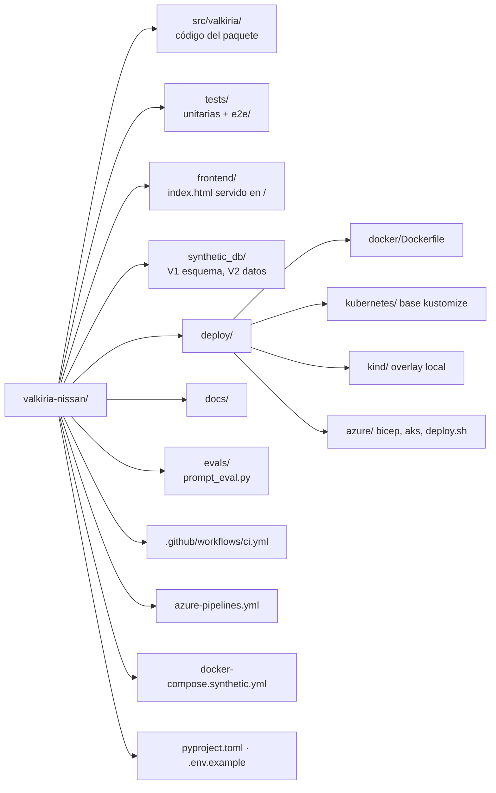
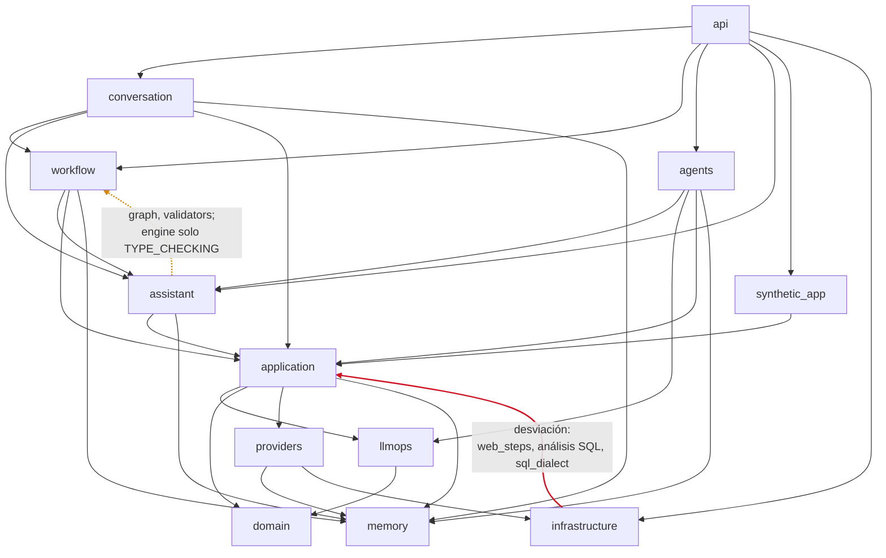
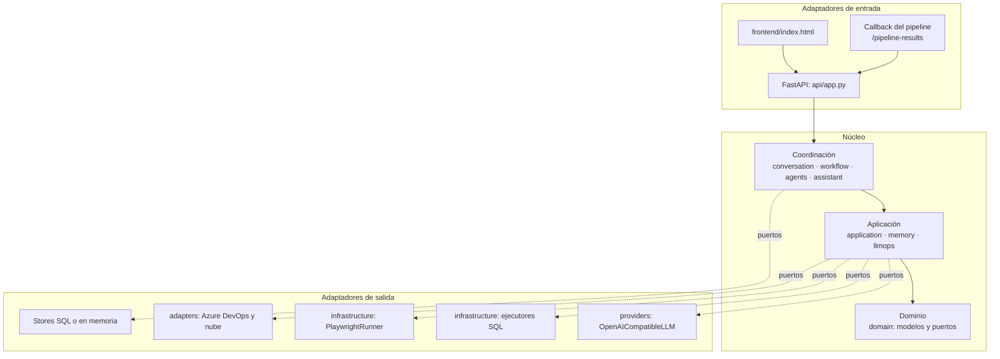
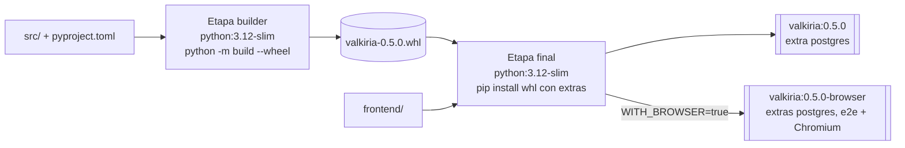
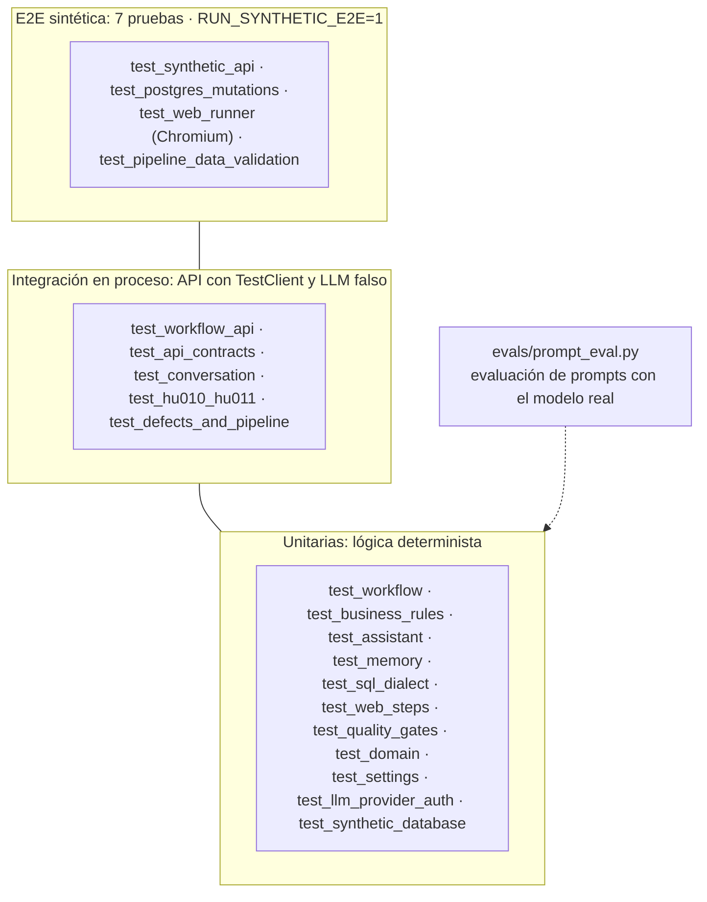
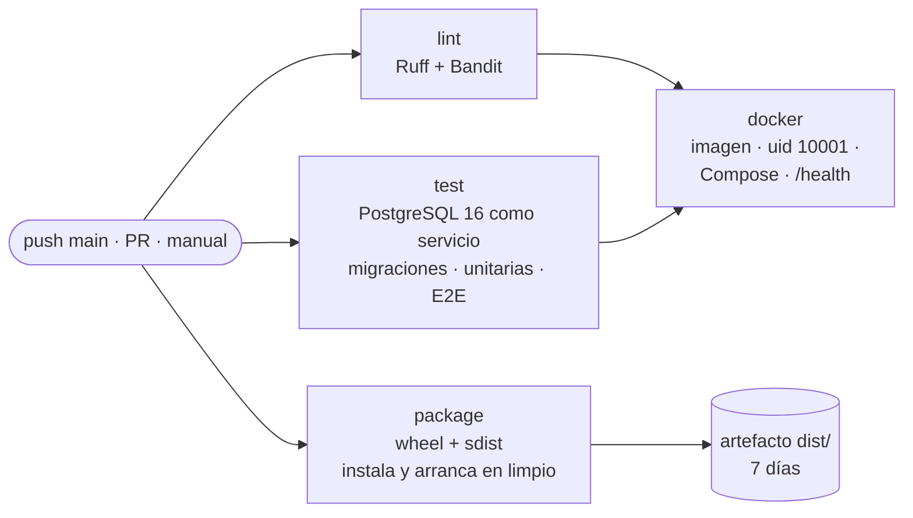
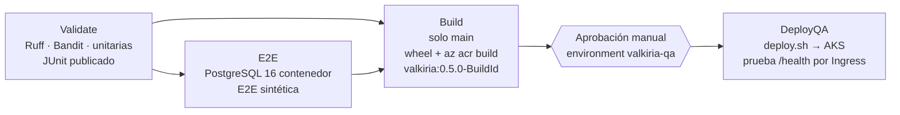

# Vista de desarrollo

[← Índice de arquitectura](../arquitectura.md)

La vista de desarrollo describe cómo está organizado el código, qué depende de qué, cómo se construye, cómo se prueba y cómo se integra.

## Estructura del repositorio

## Paquetes de `src/valkiria/`

| Paquete | Archivos | Líneas | Responsabilidad | Piezas principales |
|---|---:|---:|---|---|
| `api` | 3 | 590 | Contratos HTTP, raíz de composición, `trace_id`, errores | `create_app`, `ApplicationError` |
| `conversation` | 3 | 1 040 | Conductor del chat y mapa del flujo de 14 pasos | `ConversationController`, `_Turn`, `flow_view` |
| `workflow` | 7 | 1 473 | Grafo de capacidades, planificador, motor, ejecutores, estado y validadores | `CAPABILITIES`, `plan`, `WorkflowEngine`, `EXECUTORS`, `WorkflowState` |
| `agents` | 16 | 612 | Orquestación multiagente de una petición | `AgentRegistry`, `AgentRouter`, `MultiAgentOrchestrator`, 10 agentes |
| `assistant` | 7 | 1 104 | Razonamiento con herramientas, enrutamiento, políticas y glosario | `ReasoningAssistant`, `ToolBox`, `build_toolbox`, `route_message`, `policy_block` |
| `application` | 11 | 2 147 | Casos de uso con LLM, prompts, políticas QA, scripts, ejecución, defectos, SQL | `ValkiriaService`, `prompts`, `script_generation`, `web_steps`, `defects`, `sql_dialect` |
| `memory` | 5 | 588 | Memoria corta y larga, redacción y normalización de texto | `MemoryService`, `ShortTermMemory`, `LongTermMemory`, `redact` |
| `llmops` | 2 | 84 | Fases, quality gates G0–G6, auditoría y métricas | `LLMOpsLifecycle`, `Phase`, `Gate` |
| `domain` | 5 | 206 | Modelos y puertos | `UserStory`, `TestMatrix`, `LLMPort`, `DatabaseExecutor` |
| `providers` | 2 | 81 | Cliente LLM compatible con OpenAI | `OpenAICompatibleLLM`, `LLMProviderError` |
| `infrastructure` | 7 | 493 | Settings, logging, ejecutores SQL, Playwright, almacenes en memoria | `Settings`, `SyntheticPostgresExecutor`, `PlaywrightRunner` |
| `adapters` | 3 | 29 | Adaptadores de referencia hacia Azure | `SafeAzureDevOpsAdapter`, `CloudAdapter` |
| `synthetic_app` | 3 | 219 | App Nissan sintética: API y pantallas web | `create_synthetic_app`, `mount_web`, `UI_GUIDE` |

Total: unas 8 700 líneas de Python en el paquete, unas 2 600 de pruebas y un frontend de 591 líneas.

## Dependencias reales entre paquetes

El grafo se obtuvo de los `import` del código. Las flechas van del paquete que importa al importado. Para legibilidad se omiten las flechas directas de `api` hacia `application`, `domain`, `memory` y `providers`; `api` es la raíz de composición y depende de todos. En naranja, el ciclo entre `workflow` y `assistant`; en rojo, la desviación de `infrastructure` hacia `application`.

### Reglas que se cumplen

- `domain` y `memory` no dependen de ningún otro paquete de Valkiria.
- `domain` no hace I/O: solo modelos Pydantic y protocolos.
- Solo `api` conoce a todos: es la raíz de composición.
- Los agentes, el motor y el asistente reciben sus dependencias por constructor (LLM, ejecutor, runner, memoria) y no leen configuración.
- La configuración se lee solo con `Settings` (regla 12 de [Patrones](../patrones-y-mantenibilidad.md)). Excepción: `SyntheticPostgresExecutor` usa `os.getenv` como respaldo si no recibe la URL.

### Desviaciones conocidas

| Desviación | Dónde | Por qué existe | Remedio propuesto |
|---|---|---|---|
| `infrastructure` → `application` | `synthetic_database.py` importa el análisis estático, la evidencia y `sql_dialect`; `playwright_runner.py` importa `web_steps` | El adaptador aplica la misma política y la misma traducción de pasos que el código generado, para que ejecución y script no difieran | Mover `static_analyse_database_script`, `sql_dialect` y `web_steps` a `domain/` como políticas puras, sin I/O; ya lo son |
| Ciclo `workflow` ↔ `assistant` | `engine.py` importa `ToolContext`; `assistant/catalog.py` y `capabilities.py` importan `graph` y `validators` | El asistente consulta el flujo (`estado_flujo`, `iniciar_flujo_historia`) y el flujo responde preguntas con el asistente | Mover `ToolContext` a un módulo neutral, por ejemplo `assistant/contracts.py` sin dependencias, y exponer el grafo mediante una interfaz |
| `workflow` importa funciones privadas | `steps.py` y `engine.py` usan `_normalize_story`, `_normalize_invest` y `_story_changes` de `use_cases.py` | Reutilizar la normalización de la salida del LLM | Hacerlas públicas en un módulo `application/normalization.py` |

Ninguna desviación rompe el funcionamiento ni las pruebas. Las tres aumentan el acoplamiento y conviene corregirlas antes de agregar adaptadores reales.

## Capas y vista hexagonal

## Construcción

| Elemento | Definición |
|---|---|
| Paquete | `pyproject.toml`, `setuptools`, código en `src/`; versión 0.5.0; Python ≥ 3.11 (CI e imagen en 3.12) |
| Dependencias base | FastAPI, Pydantic 2, pydantic-settings, Uvicorn, httpx, structlog, SQLAlchemy 2, python-multipart |
| Extra `postgres` | psycopg 3 (incluido en la imagen) |
| Extra `synthetic` | psycopg + testcontainers |
| Extra `e2e` | Playwright (imagen `-browser`) |
| Extra `dev` | pytest, pytest-asyncio, Ruff, mypy, Bandit, build |
| Artefactos | Wheel y sdist (`python -m build`); imagen `valkiria:0.5.0` (unos 300 MB) y `valkiria:0.5.0-browser` (unos 2 GB) |

## Configuración

`Settings` (`infrastructure/settings.py`) es la única fuente de configuración. Usa el prefijo `VALKIRIA_` y esta precedencia: variables de entorno, `.env` del directorio actual, `.env` de la raíz del repositorio y valores por defecto seguros. `tests/test_settings.py` verifica que `.env.example` y `Settings` tengan exactamente los mismos campos.

| Grupo | Variables | Por defecto |
|---|---|---|
| Modo | `MODE`, `ENVIRONMENT`, `ALLOW_PRODUCTION` | `synthetic`, `qa`, `false` (producción no arranca) |
| LLM | `LLM_BASE_URL`, `LLM_MODEL`, `LLM_API_KEY`*, `LLM_AUTH_HEADER`, `LLM_TIMEOUT_SECONDS`, `LLM_MAX_PARALLEL` | Ollama local, `llama3.2:3b-instruct-q4_K_M`, 60 s, 4 |
| Datos | `DB_PROFILE`, `DB_ENGINE`, `SYNTHETIC_DATABASE_URL`*, `SYNTHETIC_APP_BASE_URL` | PostgreSQL sintético; sin URL usa SQLite en memoria |
| Persistencia | `WORKFLOW_DATABASE_URL`*, `MEMORY_DATABASE_URL`* | Vacías: en memoria |
| Memoria | `MEMORY_ENABLED`, `MEMORY_SHORT_TERM_TURNS`, `…_TTL_MINUTES`, `MEMORY_LONG_TERM_TOP_K`, `…_RETENTION_DAYS` | true, 12, 120, 4, 365 |
| Automatización | `AUTOMATION_RUNNER`, `AUTOMATION_EXECUTE`, `AUTOMATION_HEADLESS`, `AUTOMATION_TIMEOUT_SECONDS` | Playwright, **false**, true, 30 |
| Release | `RELEASE_MODE`, `DIRECT_COMMIT`, `PR_REQUIRED` | preview, false, true |
| Integración | `PIPELINE_CALLBACK_TOKEN`* | Vacío: el callback responde 503 |
| API | `ALLOWED_ORIGINS`, `FRONTEND_DIR` | localhost; `frontend/` del repositorio |

\* Secretos (`SecretStr`): no aparecen en `repr` ni en logs y se leen con `settings.secret(nombre)`.

## Estrategia de pruebas

189 funciones de prueba en 23 archivos.

| Nivel | Qué sustituye | Ejemplo |
|---|---|---|
| Unitarias | LLM por respuestas guionizadas (`tests/workflow_fakes.py`); `sleep` inyectado en el motor | Reintentos con espera sin esperar de verdad |
| Integración | `create_app(llm=…, synthetic_transport=…, web_runner=…)`: transporte httpx en memoria para la app sintética | Flujo completo de 11 pasos en el chat |
| E2E | Nada: PostgreSQL 16 real, app sintética real y Chromium real | `UPDATE … LIMIT` traducido a `ctid` y revertido |
| Con el modelo real | Ejecución manual contra `llama3.2:3b-instruct-q4_K_M` | Batería de 13 peticiones del asistente (26 de 26) |

`create_app` acepta `llm`, `synthetic_transport` y `web_runner` precisamente para que las pruebas sustituyan los adaptadores sin parches globales. `tests/conftest.py` aísla las unitarias del `.env` local.

## Integración continua

### GitHub Actions (`.github/workflows/ci.yml`)

Se ejecuta en cada push a `main`, en Pull Requests y manualmente.

### Azure DevOps (`azure-pipelines.yml`)

Es la ruta de despliegue a Azure.

### Gates de calidad del código

| Gate | Herramienta | Regla |
|---|---|---|
| Estilo y errores | Ruff | Selección explícita: `E4, E7, E9, F, I, B, BLE, UP, FURB, TRY004`. Sin capturas genéricas salvo fronteras de aislamiento con `noqa` justificado |
| Seguridad | Bandit | Cero hallazgos. Cinco supresiones `nosec` justificadas |
| Pruebas | pytest | Unitarias en cada push; E2E contra PostgreSQL en CI |
| Paquete | build + instalación limpia | El wheel arranca fuera del repositorio |
| Imagen | Docker | Usuario no root verificado, Compose sano |

## Puntos de extensión

| Para agregar | Dónde | Pasos |
|---|---|---|
| Una capacidad del flujo (nueva HU) | `workflow/graph.py`, `workflow/steps.py` | 1) `Capability` con `requires`, `inputs`, `approvable` y `keywords`. 2) Ejecutor `run_x(state, service, memory) -> StepOutput` registrado en `EXECUTORS`. 3) Paso en `conversation/flow.py: STEPS`. 4) Si usa memoria, `KINDS_BY_TASK`. El grafo se valida al importar |
| Una herramienta o skill del asistente | `assistant/catalog.py` | `Tool` con `Param`, `keywords` y un `Summarizer` en `SUMMARIZERS` que calcule la conclusión verificable |
| Un agente | `agents/` | Subclase de `BaseAgent` con `name`, `phase`, `can_handle` y `execute`; registrarlo en `build_default_registry` |
| Un motor de base de datos | `infrastructure/synthetic_database.py` | Implementar `DatabaseExecutor.execute` con análisis estático, transacción y rollback; elegirlo en `build_synthetic_executor` |
| Un proveedor LLM | `providers/` | Cumplir `LLMPort.generate_json`; si es compatible con OpenAI, basta configurar `VALKIRIA_LLM_*` |
| Persistencia de auditoría o reportes | `infrastructure/` | Implementar `append` o `save`/`get` como los almacenes en memoria e inyectarlo en `create_app` |
| Un prompt | `application/prompts.py` | Cambiar el texto **e incrementar `PROMPT_VERSION`** (RT-06); queda en cada artefacto |
