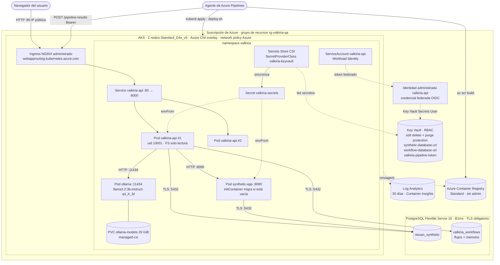
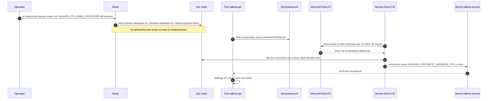
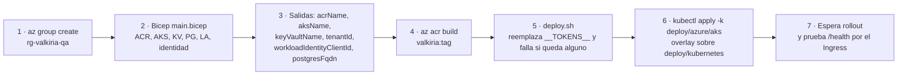
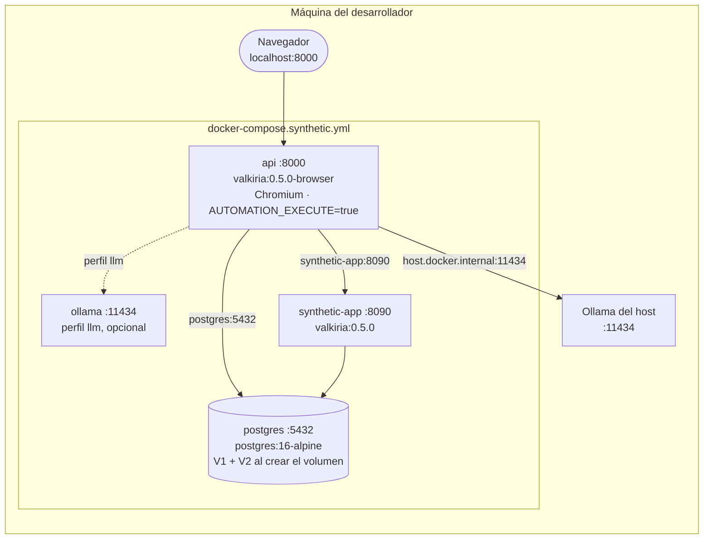
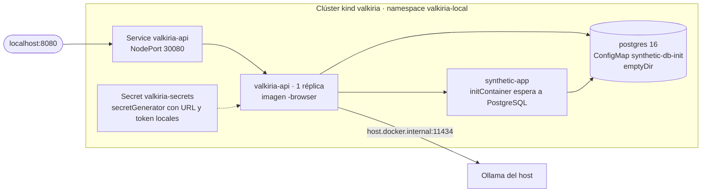
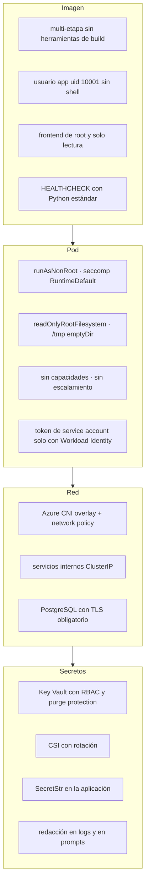

# Vista física

[← Índice de arquitectura](../arquitectura.md)

La vista física describe dónde se ejecuta cada componente, cómo se comunican los nodos y cómo se protegen. Valkiria se despliega en tres topologías con la **misma imagen**: desarrollo con Docker Compose, Kubernetes local con kind y QA en Azure (AKS). Azure es la única plataforma de destino.

| Topología | Uso | API | LLM | Base sintética | Flujos y memoria | Chromium |
|---|---|---|---|---|---|---|
| Docker Compose | Desarrollo local | 1 contenedor, imagen `-browser` | Ollama del host o perfil `llm` | PostgreSQL 16 en contenedor | En memoria | Sí (`AUTOMATION_EXECUTE=true`) |
| kind | Probar manifiestos de Kubernetes | 1 pod | Ollama del host | PostgreSQL 16 en pod (`emptyDir`) | En memoria | Sí (imagen `-browser`) |
| AKS (QA) | Entorno compartido en Azure | 2 réplicas | Ollama en el clúster | Azure Database for PostgreSQL Flexible Server | PostgreSQL (`valkiria_workflows`) | No (`AUTOMATION_EXECUTE=false`) |

## Despliegue en Azure (AKS)

### Diagrama de despliegue

### Nodos y artefactos

| Nodo | Artefacto desplegado | Recursos y configuración | Sondas |
|---|---|---|---|
| `valkiria-api` (Deployment, 2 réplicas) | `<acr>.azurecr.io/valkiria:<tag>` | ConfigMap `valkiria-config` + Secret `valkiria-secrets`; `/tmp` `emptyDir`; volumen CSI en `/mnt/secrets` | `readiness` y `liveness` en `GET /health` |
| `synthetic-app` (Deployment, 1) | Misma imagen, comando `uvicorn valkiria.synthetic_app.app:create_synthetic_app` | `initContainer` `postgres:16-alpine` aplica V1 y V2 si la base está vacía | `GET /health` |
| `ollama` (Deployment, 1) | `ollama/ollama:0.32.11` | Descarga el modelo una vez al PVC; `OLLAMA_NUM_PARALLEL=4`, `OLLAMA_KEEP_ALIVE=24h` | `readiness`: el modelo aparece en `ollama list` |
| Ingress | NGINX administrado (app routing) | Sin host ni TLS todavía: responde en la IP pública | — |
| PostgreSQL Flexible Server | Bases `nissan_synthetic` y `valkiria_workflows` | B1ms, `sslmode=require`, regla de firewall `AllowAzureServices` | — |

### Flujo de secretos (sin contraseñas en el pipeline ni en el repositorio)

### Despliegue paso a paso

En Azure DevOps, los pasos 4 a 7 los ejecutan las etapas `Build` y `DeployQA` del pipeline, con aprobación manual en el environment `valkiria-qa` y una service connection con Workload Identity federation (`valkiria-azure`).

## Desarrollo local con Docker Compose

Todos los puertos se publican solo en `127.0.0.1`. `api` y `synthetic-app` arrancan cuando sus dependencias están *healthy*. Los contenedores corren con `read_only`, `/tmp` en tmpfs, `cap_drop: [ALL]` y `no-new-privileges`.

## Kubernetes local con kind

`deploy/kind/up.sh` crea el clúster, construye y carga la imagen, aplica el overlay y espera (unos 75 s desde cero). Reutiliza `deploy/kubernetes/` como base.

## Puertos y protocolos

| Origen | Destino | Puerto | Protocolo | Autenticación |
|---|---|---|---|---|
| Navegador | Ingress / API | 80 (AKS), 8000 (Compose), 8080 (kind) | HTTP | Ninguna (`X-Actor` informativo); OIDC pendiente |
| API | Ollama | 11434 | HTTP, `/v1/chat/completions` | Ninguna en el clúster; `Bearer` o `api-key` si es un endpoint administrado |
| API | App sintética | 8090 | HTTP | Ninguna (red interna) |
| API, app sintética | PostgreSQL | 5432 | PostgreSQL con TLS en Azure | Usuario y contraseña desde Key Vault |
| Pipeline | API | 80 (Ingress) | HTTP | `Bearer valkiria-pipeline-token`, comparado con `hmac.compare_digest` |
| Pipeline | PostgreSQL sintético | 5432 | PostgreSQL | URL desde el grupo de variables ligado a Key Vault |
| AKS | ACR | 443 | HTTPS | Identidad del kubelet con `AcrPull` |
| Pods | Key Vault | 443 | HTTPS | Workload Identity |

## Endurecimiento por capa

## Brechas físicas conocidas

| Brecha | Impacto | Acción |
|---|---|---|
| Ingress sin TLS ni dominio | Tráfico en claro hacia la IP pública | Certificado desde Key Vault y DNS |
| PostgreSQL con acceso público (`AllowAzureServices`) | Cualquier servicio de Azure puede intentar conectarse | Private Endpoint o integración con VNet |
| Sin autenticación de usuarios | Cualquiera con acceso a la IP usa la API | OIDC/JWT con Microsoft Entra ID |
| AKS sin Chromium | Los scripts web no se ejecutan en QA; solo API y datos | Imagen `-browser` para la API en AKS o ejecución web solo en el pipeline |
| Ollama en CPU, 1 réplica | Latencia de 20 a 90 s por paso; punto único de falla del LLM | Nodo con GPU o endpoint administrado compatible con OpenAI |
| Imagen por etiqueta, no por digest | Una etiqueta reescrita cambia lo desplegado | Desplegar por digest |
| `CORS` con `localhost` en AKS | Restringe el uso desde otros orígenes | Configurar el dominio real |
