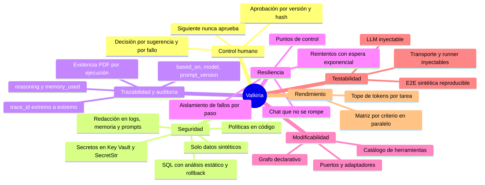
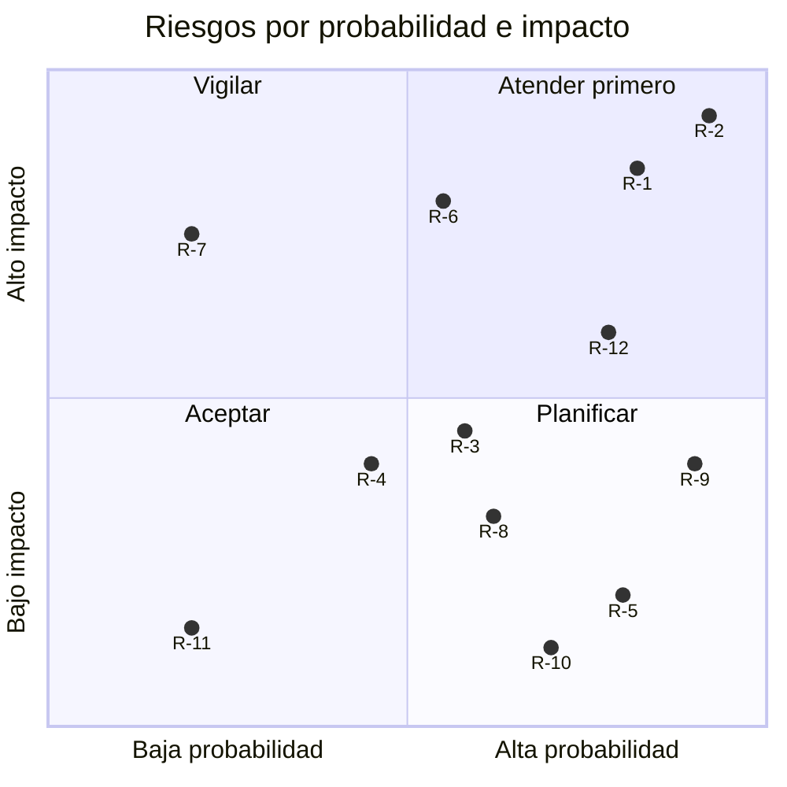

# Decisiones, atributos de calidad y riesgos

[← Índice de arquitectura](../arquitectura.md)

Este documento es transversal a las cuatro vistas. Reúne:
- las decisiones de arquitectura que dan forma a Valkiria, con su contexto y sus consecuencias;
- cómo se cumplen los atributos de calidad;
- los riesgos y la deuda técnica que quedan.

## Registro de decisiones (ADR)

| ADR | Decisión | Estado | Vistas |
|---|---|---|---|
| [ADR-01](#adr-01-planificación-determinista-el-llm-solo-redacta) | Planificación determinista sobre un grafo; el LLM solo redacta | Aceptada | Lógica, procesos |
| [ADR-02](#adr-02-llama-32-instruct-autoalojado-detrás-de-una-api-compatible-con-openai) | Llama 3.2 Instruct autoalojado detrás de una API compatible con OpenAI | Aceptada | Lógica, física |
| [ADR-03](#adr-03-azure-como-única-plataforma) | Azure como única plataforma de despliegue | Aceptada | Física |
| [ADR-04](#adr-04-monolito-modular) | Monolito modular en un proceso FastAPI | Aceptada | Desarrollo, física |
| [ADR-05](#adr-05-estado-del-flujo-como-documento-con-control-optimista) | Estado del flujo como documento JSON con control optimista | Aceptada | Lógica, procesos |
| [ADR-06](#adr-06-aprobación-ligada-a-versión-y-hash) | Aprobación ligada a versión y hash del contenido | Aceptada | Lógica, procesos |
| [ADR-07](#adr-07-memoria-de-largo-plazo-gobernada-y-búsqueda-léxica) | Memoria larga solo de decisiones humanas, con búsqueda BM25 | Aceptada | Lógica |
| [ADR-08](#adr-08-asistente-con-catálogo-cerrado-y-verificación-de-fidelidad) | Asistente con catálogo cerrado y verificación de fidelidad | Aceptada | Lógica, procesos |
| [ADR-09](#adr-09-solo-datos-sintéticos-y-producción-bloqueada-al-arrancar) | Solo datos sintéticos; producción bloqueada al arrancar | Aceptada | Física, desarrollo |
| [ADR-10](#adr-10-una-sola-traducción-de-pasos-web) | Una sola traducción de pasos web para el código generado y el runner | Aceptada | Lógica, procesos |
| [ADR-11](#adr-11-sql-seguro-análisis-estático-rollback-siempre-y-traducción-ctid) | SQL seguro: análisis estático, rollback siempre y traducción `ctid` | Aceptada | Procesos |
| [ADR-12](#adr-12-el-pipeline-devuelve-sus-resultados-a-valkiria) | El pipeline devuelve sus resultados a Valkiria | Aceptada | Procesos, física |
| [ADR-13](#adr-13-frontend-sin-framework-servido-por-la-api) | Frontend sin framework, servido por la API | Aceptada | Desarrollo, física |

### ADR-01 Planificación determinista; el LLM solo redacta

- **Contexto:** un modelo de 3B parámetros no es confiable para decidir dependencias, aprobaciones ni el orden de los pasos. Además, un flujo decidido por el modelo no es reproducible ni auditable.
- **Decisión:** el grafo `CAPABILITIES` declara dependencias, aprobaciones e insumos. `plan()` decide en código qué hacer con cada capacidad (`reuse`, `run`, `rerun`, `blocked`…). El enrutamiento del chat (`route_message`, `_Turn.understand`) también es por reglas. El LLM solo genera el contenido de cada paso.
- **Consecuencias:** comportamiento reproducible y explicable en `reasoning`. A cambio, el vocabulario de detección (palabras clave y expresiones regulares) debe mantenerse, y una petición muy ambigua puede ir a la ruta equivocada ([R-4](#riesgos-y-deuda-técnica)).

### ADR-02 Llama 3.2 Instruct autoalojado detrás de una API compatible con OpenAI

- **Contexto:** los datos no deben salir del entorno controlado, se busca un costo bajo y se requiere portabilidad entre local, Compose, kind y AKS.
- **Decisión:** `llama3.2:3b-instruct-q4_K_M` servido por Ollama. Valkiria lo consume con `OpenAICompatibleLLM` (`/v1/chat/completions`, `response_format: json_object`, `temperature 0.1`, tope de tokens por tarea). El mismo adaptador admite un endpoint administrado con `api-key`.
- **Consecuencias:** la salida del modelo es imperfecta, de ahí el ciclo generar → validar → corregir → completar. La latencia en CPU es alta, por lo que la matriz se genera por criterio en paralelo. Cambiar de modelo es solo configuración.

### ADR-03 Azure como única plataforma

- **Contexto:** es una decisión organizacional, y las integraciones son con Azure DevOps.
- **Decisión:** AKS, ACR, Key Vault con Workload Identity, PostgreSQL Flexible Server, Log Analytics y Azure DevOps. Bicep para la infraestructura y kustomize para los manifiestos. La performance se diseñará para Azure Load Testing (JMeter o Locust).
- **Consecuencias:** sin abstracción multinube; `CloudAdapter` solo tiene la implementación `azure`.

### ADR-04 Monolito modular

- **Contexto:** es un equipo pequeño. Los agentes comparten contexto, memoria y casos de uso, y el estado del flujo exige consistencia fuerte.
- **Decisión:** un solo proceso FastAPI con paquetes de responsabilidades claras; la composición ocurre en `create_app`. Los "agentes" son objetos en el mismo proceso, no servicios.
- **Consecuencias:** despliegue, depuración y pruebas simples, sin red entre agentes. El escalado es por réplica completa, y el estado en memoria por réplica es un riesgo ([R-1](#riesgos-y-deuda-técnica)).

### ADR-05 Estado del flujo como documento con control optimista

- **Contexto:** el flujo es un agregado con artefactos versionados, aprobaciones, fallos y razonamiento que cambian juntos.
- **Decisión:** `WorkflowState` se guarda completo como JSON en `valkiria_workflows(id, revision, state)`. Cada guardado incrementa `revision` con `UPDATE … WHERE revision = esperada`, y el conflicto devuelve `409`. Hay un punto de control tras cada paso.
- **Consecuencias:** consistencia simple, sin migraciones por campo, y sirve igual en SQLite y PostgreSQL. A cambio, no hay consultas por contenido y el documento crece con `history` y `reasoning` ([R-8](#riesgos-y-deuda-técnica)).

### ADR-06 Aprobación ligada a versión y hash

- **Contexto:** RT-02 exige que una persona apruebe exactamente lo que se usa después.
- **Decisión:** `Approval(version, content_hash)`. `ArtifactRecord.approved` se calcula, y cualquier cambio de contenido la invalida sin borrarla. Aprobar una versión superada devuelve `409 stale_version`. Algunas aprobaciones exigen decisiones adicionales: los supuestos de la HU, cada sugerencia INVEST y cada fallo de la revisión.
- **Consecuencias:** no hay aprobaciones "heredadas" por error. La interfaz debe enviar la versión que mostró.

### ADR-07 Memoria de largo plazo gobernada y búsqueda léxica

- **Contexto:** recordar decisiones del equipo mejora las siguientes HU, pero aprender de borradores del modelo amplifica sus errores.
- **Decisión:** solo se memorizan decisiones humanas (aprobaciones, rechazos con comentario, ediciones), fallos definitivos y registros explícitos. El contenido se redacta antes de guardarse, se deduplica por `namespace` y caduca. La búsqueda es BM25 con decaimiento, y `LongTermStore` es una interfaz sustituible.
- **Consecuencias:** es explicable (`memory_used`) y no requiere un modelo de embeddings. El recall semántico es limitado y podría migrarse a pgvector o Azure AI Search sin tocar a los agentes.

### ADR-08 Asistente con catálogo cerrado y verificación de fidelidad

- **Contexto:** las preguntas fuera del flujo no deben forzarse a ser una HU. Un modelo pequeño inventa datos, se niega teniéndolos o invierte calificadores.
- **Decisión:** el modelo solo invoca herramientas registradas. El código valida los argumentos y ejecuta con tiempo límite. Cada herramienta calcula una `Summary` verificable, y la redacción del modelo se acepta solo si es fiel. Las políticas se resuelven en código, antes del modelo.
- **Consecuencias:** respuestas verificables, con `mode` y `tools_used`. Cada salvaguarda nueva requiere una prueba de regresión.

### ADR-09 Solo datos sintéticos y producción bloqueada al arrancar

- **Decisión:** `Settings` falla al iniciar con `ENVIRONMENT=production` sin `ALLOW_PRODUCTION=true`. Los requests nunca aceptan DSN ni credenciales. Los ejecutores solo aceptan perfiles sintéticos.
- **Consecuencias:** el riesgo de tocar datos reales es mínimo. Ir a producción exige una decisión explícita y nuevos adaptadores.

### ADR-10 Una sola traducción de pasos web

- **Contexto:** si el script entregado y el runner interpretan los pasos de forma distinta, la evidencia no representa lo que hará el PR.
- **Decisión:** `application/web_steps.py: plan_case` aterriza cada paso en el catálogo de pantallas (`SCREENS`). La usan el generador de Playwright y Selenium y `PlaywrightRunner`.
- **Consecuencias:** lo ejecutado en Valkiria equivale a lo entregado. Esta decisión es la causa de la dependencia `infrastructure` → `application` ([R-5](#riesgos-y-deuda-técnica)).

### ADR-11 SQL seguro: análisis estático, rollback siempre y traducción ctid

- **Decisión:** el análisis estático corre antes de conectar. Las mutaciones exigen `WHERE`, `LIMIT` en cada `UPDATE` y `DELETE`, transacción y rollback. La ejecución siempre termina en `rollback`. En PostgreSQL, `UPDATE/DELETE … LIMIT n` se traduce a `ctid IN (SELECT … LIMIT n FOR UPDATE)` solo para formas simples; el resto se bloquea (fail closed).
- **Consecuencias:** las pruebas de mutación no dejan rastro. Algunas formas válidas de SQL se rechazan a propósito.

### ADR-12 El pipeline devuelve sus resultados a Valkiria

- **Decisión:** el YAML de HU-007 incluye `DataValidation` (solo lectura) y `ReportToValkiria` (`condition: always()`), que hace `POST /pipeline-results` con un token Bearer de Key Vault. Valkiria registra los resultados como una nueva versión de la ejecución y prepara la revisión de fallos. El PR no se aprueba con fallos sin revisar.
- **Consecuencias:** un solo circuito de evidencia para local y CI. El endpoint queda expuesto por el Ingress y se protege solo con el token ([R-6](#riesgos-y-deuda-técnica)).

### ADR-13 Frontend sin framework servido por la API

- **Decisión:** `frontend/index.html` con JavaScript sin framework ni build, servido en `/` por la API (mismo origen, sin CORS adicional).
- **Consecuencias:** cero cadena de build y despliegue trivial. A medida que crezca la interfaz, mantener un archivo de 591 líneas será más costoso.

## Atributos de calidad

### Árbol de utilidad

### Escenarios de calidad

| Atributo | Estímulo | Respuesta esperada | Medida | Mecanismo |
|---|---|---|---|---|
| Control humano | Un usuario pide "siguiente" con la HU sin aprobar | El flujo pide la aprobación; no aprueba | 0 aprobaciones implícitas | `continue_flow`, prueba en `test_conversation.py` |
| Control humano | Se aprueba v2 cuando ya existe v3 | Rechazo con el código de versión vigente | `409 stale_version` | `WorkflowEngine.approve` |
| Seguridad | Un script contiene `DROP TABLE` | Bloqueo antes de conectar | 0 conexiones abiertas | `static_analyse_database_script` |
| Seguridad | "Despliega en producción" | Rechazo con alternativa, sin llamar al LLM | `mode=policy` | `policy_block` |
| Seguridad | El usuario escribe un token en el chat | No llega al modelo, a la memoria ni a los logs | Texto redactado | `redact`, `JsonFormatter` |
| Resiliencia | Ollama tarda más de 60 s | Reintentos y luego un paso `failed` reanudable; el chat responde | Error reintentable con `trace_id` | Motor y `/v1/chat` |
| Resiliencia | Falla la matriz | El riesgo se evalúa igual | Las ramas independientes completan | `exhausted` en `_run` |
| Resiliencia | Falla el almacén de memoria | El flujo continúa sin memoria | 0 pasos fallidos por memoria | `try/except` en `_recall` y `_remember` |
| Trazabilidad | Un auditor pregunta de dónde salió la matriz v3 | Se identifica la versión de la HU, el modelo, el prompt y los recuerdos usados | 1 consulta (`GET /v1/workflows/{id}`) | `ArtifactRecord` |
| Modificabilidad | Agregar una nueva HU al flujo | Capacidad, ejecutor y paso del panel | 3 o 4 archivos, sin tocar el motor | Grafo declarativo |
| Modificabilidad | Cambiar el modelo | Solo configuración | 0 cambios de código | `VALKIRIA_LLM_*` |
| Testabilidad | Probar el flujo completo sin GPU | LLM guionizado | 182 pruebas en segundos | `create_app(llm=…)` |
| Rendimiento | Matriz de una HU con 3 criterios en CPU | Tiempo aceptable | De 57 s a 23 s medido | Paralelismo por criterio |
| Portabilidad | Mismo código en Compose, kind y AKS | Misma imagen | 1 imagen base y 1 con navegador | Settings y kustomize |

## Riesgos y deuda técnica

| Id | Riesgo o deuda | Probabilidad | Impacto | Evidencia en el código | Mitigación propuesta |
|---|---|---|---|---|---|
| R-1 | Auditoría, métricas, historias, lotes, ejecuciones y reportes en memoria por réplica: se pierden al reiniciar y no se comparten entre las 2 réplicas de AKS | Alta | Alto | `InMemoryAudit`, `InMemoryReportStore`… en `create_app` | Almacenes SQL en `valkiria_workflows` y retención de auditoría definida |
| R-2 | Sin autenticación: `X-Actor` es un encabezado libre, de modo que la autoría de una aprobación (RT-02) no está verificada | Alta | Alto | `Header(default="anonymous")` en todos los endpoints | OIDC/JWT con Microsoft Entra ID y actor tomado del token |
| R-3 | LLM en CPU con una réplica: latencia alta y punto único de falla | Media | Medio | `ollama.yaml`, `replicas: 1` | Nodo con GPU, más réplicas o endpoint administrado |
| R-4 | Enrutamiento e intención por expresiones regulares: peticiones fuera del vocabulario pueden ir a la ruta equivocada | Media | Medio | `routing.py`, `controller.py` (782 líneas), `detect_goals` | Ampliar la batería de regresión; clasificación por LLM solo como desempate validado |
| R-5 | Desviaciones de capas (`infrastructure` → `application`, ciclo `workflow` ↔ `assistant`, funciones privadas compartidas) | Alta | Bajo | [Vista de desarrollo](04-vista-desarrollo.md#desviaciones-conocidas) | Mover políticas puras a `domain` y `ToolContext` a un módulo neutral |
| R-6 | Superficie expuesta: Ingress sin TLS, PostgreSQL con `AllowAzureServices`, callback del pipeline protegido solo con token | Media | Alto | `ingress.yaml`, `main.bicep` | TLS, Private Endpoint y, opcionalmente, restricción por IP de los agentes |
| R-7 | Bloqueo del flujo por proceso: sin `WORKFLOW_DATABASE_URL`, dos réplicas no comparten el estado | Baja en AKS | Alto | `_locks` en `WorkflowEngine` | Exigir el almacén SQL cuando `replicas > 1` |
| R-8 | `WorkflowState` crece sin límite (`history`, `reasoning`) en una sola fila JSON | Media | Medio | `put_artifact`, `think` | Compactar el historial o moverlo a una tabla de versiones |
| R-9 | Integraciones pendientes: HU-004B, publicación real de HU-006 y HU-008B | Alta | Medio | `available=False`, `SafeAzureDevOpsAdapter` de referencia | Adaptadores con OAuth, idempotencia y pruebas de contrato |
| R-10 | Agentes de `/v1/agent/execute` parcialmente demostrativos: `EvaluationAgent` devuelve INVEST `pending_review` fijo y `DatabaseAgent` corre una consulta de referencia | Alta | Bajo | `agents/evaluation.py`, `agents/database.py` | Delegar en los ejecutores del flujo o documentar el endpoint como demostración |
| R-11 | El esquema sintético no declara llaves foráneas | Baja | Bajo | `V1__create_schema.sql` | Agregar FK para que las pruebas de integridad sean realistas |
| R-12 | Ejecución web no disponible en AKS (imagen sin Chromium) | Alta | Medio | `AUTOMATION_EXECUTE=false` en la base | Imagen `-browser` para la API en QA o ejecutar la web solo en el pipeline |

## Hoja de ruta arquitectónica sugerida

```mermaid
flowchart LR
    subgraph F1["Fase 1 · Base productiva"]
        a1["OIDC/JWT con Entra ID (R-2)"]
        a2["Auditoría, reportes y lotes en SQL (R-1)"]
        a3["TLS en Ingress y Private Endpoint (R-6)"]
    end
    subgraph F2["Fase 2 · Calidad interna"]
        b1["Corregir desviaciones de capas (R-5)"]
        b2["Historial de versiones en tabla (R-8)"]
        b3["Partir controller.py por intención (R-4)"]
    end
    subgraph F3["Fase 3 · Integraciones"]
        c1["Azure Boards real: HU-006 y HU-004B (R-9)"]
        c2["Azure Load Testing: HU-008B (R-9)"]
        c3["Chromium en QA o solo en pipeline (R-12)"]
    end
    subgraph F4["Fase 4 · Escala del LLM"]
        d1["GPU o endpoint administrado (R-3)"]
        d2["Búsqueda vectorial opcional en memoria"]
    end
    F1 --> F2 --> F3 --> F4
```

